# Company Research Agent

- AI-powered Corporate Research Agent - 企業情報収集・分析エージェント
- EDINETや企業ホームページを検索してその結果をまとめるエージェントを開発中


## アーキテクチャ

### ディレクトリ構造

```
src/company_research_agent/
├── api/           # REST API (FastAPI)
├── cli/           # CLIツール (cra コマンド)
├── clients/       # 外部APIクライアント (EDINET, Gemini)
├── parsers/       # XBRL/PDF解析
├── services/      # ビジネスロジック
├── repositories/  # データアクセス
├── models/        # SQLAlchemyモデル
├── schemas/       # Pydanticスキーマ
├── llm/           # LLMプロバイダー抽象化
├── observability/ # オブザーバビリティ (Langfuse統合)
├── orchestrator/  # 自然言語検索オーケストレーター
├── tools/         # LangChainツール群
├── prompts/       # LLMプロンプト
├── workflows/     # LangGraphワークフロー
└── core/          # 設定、例外、ユーティリティ

tests/
├── unit/          # ユニットテスト
├── integration/   # 統合テスト
└── e2e/           # E2Eテスト

docs/              # プロジェクトドキュメント
scripts/           # ユーティリティスクリプト
```

### レイヤー構成図


### データフロー


### LangGraph ワークフロー

有価証券報告書のLLM分析ワークフロー（`AnalysisGraph`）のノード構成：

```mermaid
graph TD
    START((Start)) --> edinet

    subgraph "データ取得"
        edinet[EDINETNode<br/>書類ダウンロード]
        pdf_parse[PDFParseNode<br/>PDF解析・Markdown変換]
    end

    subgraph "並列LLM分析"
        business_summary[BusinessSummaryNode<br/>事業内容要約]
        risk_extraction[RiskExtractionNode<br/>リスク情報抽出]
        financial_analysis[FinancialAnalysisNode<br/>財務分析]
    end

    subgraph "統合処理"
        period_comparison[PeriodComparisonNode<br/>前期比較分析]
        aggregator[AggregatorNode<br/>レポート統合]
    end

    edinet --> pdf_parse
    pdf_parse --> business_summary
    pdf_parse --> risk_extraction
    pdf_parse --> financial_analysis
    business_summary --> period_comparison
    risk_extraction --> period_comparison
    financial_analysis --> period_comparison
    period_comparison --> aggregator
    aggregator --> END((End))

    style edinet fill:#e1f5fe
    style pdf_parse fill:#e1f5fe
    style business_summary fill:#fff3e0
    style risk_extraction fill:#fff3e0
    style financial_analysis fill:#fff3e0
    style period_comparison fill:#e8f5e9
    style aggregator fill:#e8f5e9
```



| ノード | 説明 | 入力 | 出力 |
|--------|------|------|------|
| `edinet` | EDINET APIから書類をダウンロード | doc_id | pdf_path |
| `pdf_parse` | PDFをMarkdown形式に変換 | pdf_path | markdown_content |
| `business_summary` | 事業内容の要約を生成 | markdown_content | business_summary |
| `risk_extraction` | リスク情報を抽出・分類 | markdown_content | risk_analysis |
| `financial_analysis` | 財務指標を分析 | markdown_content | financial_analysis |
| `period_comparison` | 前期との比較分析 | 各分析結果 | period_comparison |
| `aggregator` | 全分析結果を統合レポート化 | 全結果 | final_report |

### 自然言語検索オーケストレーター

ReActエージェントベースの自然言語検索オーケストレーター（`QueryOrchestrator`）のアーキテクチャ：

```mermaid
graph TD
    subgraph "QueryOrchestrator"
        AGENT[ReAct Agent<br/>LangGraph]
        PROMPT[System Prompt<br/>意図判定ルール]
    end

    subgraph "検索系ツール"
        SEARCH_COMPANY[search_company<br/>企業名検索]
        SEARCH_DOCS[search_documents<br/>書類検索]
        DOWNLOAD[download_document<br/>書類ダウンロード]
    end

    subgraph "分析系ツール"
        ANALYZE[analyze_document<br/>AnalysisGraph]
        COMPARE[compare_documents<br/>書類比較]
        SUMMARIZE[summarize_document<br/>書類要約]
    end

    subgraph "データソース"
        EDINET_LIST[EDINETCodeListClient<br/>企業リスト・キャッシュ]
        EDINET_API[EDINET API]
        PDF_PARSER[PDFParser]
        LLM[LLM Provider]
    end

    AGENT --> SEARCH_COMPANY
    AGENT --> SEARCH_DOCS
    AGENT --> DOWNLOAD
    AGENT --> ANALYZE
    AGENT --> COMPARE
    AGENT --> SUMMARIZE

    SEARCH_COMPANY --> EDINET_LIST
    SEARCH_DOCS --> EDINET_API
    DOWNLOAD --> EDINET_API
    ANALYZE --> PDF_PARSER
    ANALYZE --> LLM
    COMPARE --> PDF_PARSER
    COMPARE --> LLM
    SUMMARIZE --> PDF_PARSER
    SUMMARIZE --> LLM

    style AGENT fill:#e3f2fd
    style SEARCH_COMPANY fill:#fff3e0
    style SEARCH_DOCS fill:#fff3e0
    style DOWNLOAD fill:#fff3e0
    style ANALYZE fill:#e8f5e9
    style COMPARE fill:#e8f5e9
    style SUMMARIZE fill:#e8f5e9
```



| ツール | 説明 | 入力 | 出力 |
|--------|------|------|------|
| `search_company` | 企業名のあいまい検索 | query | CompanyCandidate[] |
| `search_documents` | EDINET書類検索 | edinet_code, doc_type_codes | DocumentMetadata[] |
| `download_document` | 書類PDFダウンロード | doc_id | pdf_path |
| `analyze_document` | AnalysisGraphによる詳細分析 | doc_id | ComprehensiveReport |
| `compare_documents` | 複数書類の比較分析 | doc_ids, aspects | ComparisonReport |
| `summarize_document` | 書類要約 | doc_id, focus | Summary |

## 開発状況

### フェーズ概要

本プロジェクトは段階的なフェーズアプローチで開発を進めています。

| フェーズ | タイトル | ステータス | 説明 |
|---------|---------|----------|------|
| 1 | EDINET API連携 | ✅ 完了 | 書類一覧取得、ダウンロード、リトライ処理 |
| 2 | PDF解析 | ✅ 完了 | pymupdf4llm/yomitoku/Geminiによるマルチ戦略解析 |
| 3 | LLM分析 | ✅ 完了 | LangGraphワークフローによる並列分析パイプライン |
| 3.5 | 自然言語検索 | ✅ 完了 | ReActエージェントによるクエリ処理 |
| 4 | XBRL解析 | 🔄 進行中 | 財務三表の主要項目抽出（edinet-xbrl） |
| 5 | 統合・検証 | ⏳ 計画中 | 10社テストデータでの検証、PostgreSQL保存 |
| 6 | 機能拡充 | ⏳ 計画中 | 財務指標計算、日次バッチ処理 |
| P1 | 情報源拡張 | ⏳ 計画中 | ベクトル検索、企業ホームページ取得 |

### 将来の拡張予定

メインフェーズ完了後、以下の機能拡張を予定しています：

- **企業ホームページ検索**: IR情報、プレスリリース、製品情報の自動収集
- **ベクトル検索**: 過去の分析結果や書類内容のセマンティック検索
- **TDnet連携**: 適時開示情報の取得・分析

### 現在の実装状況

フェーズ3.5まで完了し、以下の機能が利用可能です：

- **情報収集**: EDINET APIからの書類検索・ダウンロード
- **PDF解析**: 段階的戦略による効率的なマークダウン変換
- **LLM分析**: 事業要約、リスク抽出、財務分析、前期比較
- **自然言語クエリ**: 「トヨタの有報を分析して」のような自然文での操作

### 実装済みコンポーネント

| コンポーネント | ステータス | 説明 |
|---------------|----------|------|
| cli/ | ✅ | CLIツール（cra コマンド） |
| clients/ | ✅ | EDINET/Gemini/Visionクライアント |
| parsers/ | ✅ | PDF解析（3戦略フォールバック） |
| services/ | ✅ | ドキュメント検索・キャッシュ |
| tools/ | ✅ | LangChainツール（6種） |
| llm/ | ✅ | OpenAI/Google/Anthropic/Ollama対応 |
| observability/ | ✅ | Langfuse統合（LLMトレース・分析） |
| workflows/ | ✅ | LangGraph並列分析ワークフロー |
| orchestrator/ | ✅ | ReActエージェント |
| schemas/ | ✅ | Pydanticスキーマ |
| prompts/ | ✅ | LLMプロンプト |
| core/ | ✅ | 基盤機能 |
| api/ | ⏳ | REST API（計画中） |
| repositories/ | ⏳ | データアクセス層（計画中） |
| models/ | ⏳ | SQLAlchemyモデル（計画中） |

## セットアップ

```bash
# 依存関係のインストール
uv sync --dev

# 環境変数の設定
cp .env.example .env
# .envファイルを編集して以下を設定:
# - EDINET_API_KEY: EDINET APIキー
# - LLM_PROVIDER: LLMプロバイダー（google/openai/anthropic/ollama）
# - 対応するAPIキー（GOOGLE_API_KEY, OPENAI_API_KEY, ANTHROPIC_API_KEY）
```

## CLIツール（cra コマンド）

コマンドラインから企業検索・書類ダウンロード・PDF分析ができます。

> **cra** = **C**ompany **R**esearch **A**gent

### 使用方法

```bash
# 企業検索
cra search --name "トヨタ"
cra search --sec-code 72030

# 書類一覧（直近1年の有報・四半期報）
cra list --sec-code 72030 --doc-types 120,140

# 書類一覧（期間指定）
cra list --sec-code 72030 --start-date 2023-01-01 --end-date 2024-12-31

# 書類ダウンロード
cra download --sec-code 72030 --doc-types 120 --limit 3

# 書類ダウンロード（期間指定）
cra download --sec-code 72030 --start-date 2024-01-01 --end-date 2024-06-30

# PDF→マークダウン変換
cra markdown --doc-id S100VWVY --output result.md

# 自然言語クエリ
cra query "トヨタの有報を分析して"

# 対話モード
cra chat

# キャッシュ管理
cra cache --stats
cra cache --list --sec-code 72030

# デバッグモード（詳細ログ表示）
cra -v list --sec-code 72030
LOG_LEVEL=DEBUG cra list --sec-code 72030
```

### グローバルオプション

| オプション | 説明 |
|-----------|------|
| `-v, --verbose` | 詳細ログを表示（DEBUGレベル） |

環境変数 `LOG_LEVEL` でもログレベルを制御できます（DEBUG/INFO/WARNING/ERROR）。

### サブコマンド一覧

| コマンド | 説明 |
|---------|------|
| `search` | 企業検索（名前/証券コード/EDINETコード） |
| `list` | 書類一覧（期間・書類種別でフィルタ） |
| `download` | PDF/XBRLダウンロード |
| `markdown` | PDF→マークダウン変換 |
| `query` | 自然言語クエリ実行 |
| `chat` | 対話モード |
| `cache` | ダウンロード済み書類の管理 |

### 書類種別コード

| コード | 種別 |
|--------|------|
| `120` | 有価証券報告書 |
| `140` | 四半期報告書 |
| `160` | 半期報告書 |
| `180` | 臨時報告書 |

詳細は `cra --help` または `cra <command> --help` で確認できます。

## EDINET API連携

金融庁のEDINET APIを使用して、有価証券報告書等の開示書類を取得できます。

### APIキーの取得

1. [EDINET API](https://api.edinet-fsa.go.jp/api/auth/index.aspx?mode=1)にアクセス
2. アカウント登録・APIキー発行

### 使用例

```python
import asyncio
from datetime import date
from pathlib import Path

from company_research_agent.clients.edinet_client import EDINETClient
from company_research_agent.core.config import EDINETConfig

async def main():
    config = EDINETConfig()  # 環境変数EDINET_API_KEYから自動読み込み

    async with EDINETClient(config) as client:
        # 書類一覧を取得
        docs = await client.get_document_list(date(2024, 6, 28))
        print(f"書類数: {docs.metadata.resultset.count}")

        # 有価証券報告書のPDFをダウンロード（最大10件）
        download_count = 0
        for doc in docs.results or []:
            if doc.doc_type_code == "120" and doc.pdf_flag:
                await client.download_document(
                    doc.doc_id, 2, Path(f"downloads/{doc.doc_id}.pdf")
                )
                download_count += 1
                if download_count >= 10:
                    break

asyncio.run(main())
```

### 書類検索サービスの使用例

`EDINETDocumentService`を使用すると、証券コード・会社名・書類種別などで柔軟に検索できます。

```python
import asyncio
from datetime import date

from company_research_agent.clients.edinet_client import EDINETClient
from company_research_agent.core.config import EDINETConfig
from company_research_agent.schemas.document_filter import DocumentFilter
from company_research_agent.services import EDINETDocumentService

async def main():
    config = EDINETConfig()

    async with EDINETClient(config) as client:
        service = EDINETDocumentService(client)

        # 証券コードで検索（トヨタ自動車: 72030）
        filter = DocumentFilter(
            sec_code="72030",
            doc_type_codes=["120"],  # 有価証券報告書
            start_date=date(2024, 1, 1),
            end_date=date(2024, 12, 31),
        )
        docs = await service.search_documents(filter)
        print(f"トヨタの有価証券報告書: {len(docs)}件")

        # 会社名で部分一致検索
        filter = DocumentFilter(
            company_name="ソニー",
            start_date=date(2024, 6, 1),
            end_date=date(2024, 6, 30),
        )
        docs = await service.search_documents(filter)
        print(f"ソニー関連の書類: {len(docs)}件")

asyncio.run(main())
```

### 動作確認

```bash
# .envファイルにEDINET_API_KEYを設定（初回のみ）
cp .env.example .env
# .envファイルを編集してEDINET_API_KEYを設定

# 動作確認スクリプトを実行（.envから自動読み込み）
uv run python scripts/validate_edinet_api.py

# 特定の日付を指定
uv run python scripts/validate_edinet_api.py --date 2024-06-28

# 期間を指定して検索
uv run python scripts/validate_edinet_api.py --start-date 2024-06-01 --end-date 2024-06-30

# 証券コードで検索（トヨタ自動車）
uv run python scripts/validate_edinet_api.py --sec-code 72030 --start-date 2024-01-01

# 会社名で部分一致検索
uv run python scripts/validate_edinet_api.py --company-name ソニー --start-date 2024-06-01

# 書類種別を指定（有価証券報告書のみ）
uv run python scripts/validate_edinet_api.py --doc-types 120 --start-date 2024-06-01

# PDFダウンロードも実行
uv run python scripts/validate_edinet_api.py --download

# 表示件数を指定（0で全件表示）
uv run python scripts/validate_edinet_api.py --limit 0
```

## PDF解析

有価証券報告書等のPDFファイルからテキストを抽出し、マークダウン形式に変換できます。

### 解析戦略

| 戦略 | 説明 | コスト |
|------|------|--------|
| `auto` | 自動選択（pymupdf4llm → yomitoku → gemini） | - |
| `pdfplumber` | 基本テキスト抽出 | 無料 |
| `pymupdf4llm` | 構造保持マークダウン変換 | 無料 |
| `yomitoku` | 日本語OCR（複雑な表、スキャンPDF） | 無料 |
| `gemini` | LLMベース抽出（最終手段） | API課金 |

### 使用例

```python
from pathlib import Path

from company_research_agent.parsers import PDFParser

# PDFParserを初期化
parser = PDFParser()

# PDFのメタデータを取得
info = parser.get_info(Path("document.pdf"))
print(f"ページ数: {info.total_pages}")
print(f"目次: {info.table_of_contents}")

# マークダウン形式に変換（自動戦略）
result = parser.to_markdown(Path("document.pdf"), strategy="auto")
print(f"使用戦略: {result.strategy_used}")
print(result.text)

# 特定のページ範囲を抽出
result = parser.to_markdown(
    Path("document.pdf"),
    start_page=1,
    end_page=10,
    strategy="pymupdf4llm"
)
```

### Gemini APIを使用する場合

Gemini APIを最終手段として使用する場合は、`GeminiConfig`を渡します。

```python
from pathlib import Path

from company_research_agent.core.config import GeminiConfig
from company_research_agent.parsers import PDFParser

# Gemini設定（環境変数GOOGLE_API_KEYから自動読み込み）
gemini_config = GeminiConfig()

# Gemini対応のPDFParserを初期化
parser = PDFParser(gemini_config=gemini_config)

# 自動戦略（Geminiへのフォールバックあり）
result = parser.to_markdown(Path("document.pdf"), strategy="auto")

# 直接Geminiを使用
result = parser.to_markdown(Path("document.pdf"), strategy="gemini")
```

## 自然言語検索オーケストレーター

自然言語クエリを処理するReActエージェントベースのオーケストレーターです。
「トヨタの有報を分析して」のような自然言語で企業リサーチを実行できます。

### 基本的な使用例

```python
import asyncio

from company_research_agent.orchestrator import QueryOrchestrator

async def main():
    orchestrator = QueryOrchestrator()

    # 企業検索
    result = await orchestrator.process("トヨタの有報を探して")
    print(f"意図: {result.intent}")  # "検索"
    print(f"使用ツール: {result.tools_used}")  # ["search_company", "search_documents"]
    print(f"結果: {result.result}")  # エージェントの応答テキスト

asyncio.run(main())
```

### OrchestratorResultの構造

`process()`メソッドは`OrchestratorResult`を返します。

```python
from company_research_agent.schemas.query_schemas import OrchestratorResult

# OrchestratorResultの属性
result.query        # 元のクエリ（str）
result.intent       # 判定された意図: "検索" | "分析" | "比較" | "要約" | "取得" | "その他"
result.tools_used   # 使用されたツールのリスト（list[str]）
result.result       # 処理結果（エージェントの最終応答）
```

### ユースケース別の使用例

#### 1. 企業検索（書類リストの取得）

```python
async def search_example():
    orchestrator = QueryOrchestrator()

    # 企業名で書類を検索
    result = await orchestrator.process("トヨタの有価証券報告書を探して")

    print(f"意図: {result.intent}")  # "検索"
    print(f"ツール: {result.tools_used}")  # ["search_company", "search_documents"]
    print(result.result)
    # -> トヨタ自動車株式会社（E02144）の有価証券報告書を検索しました。
    #    見つかった書類: ...
```

#### 2. 書類分析（詳細レポート生成）

```python
async def analyze_example():
    orchestrator = QueryOrchestrator()

    # 書類の詳細分析
    result = await orchestrator.process("トヨタの最新の有報を分析して")

    print(f"意図: {result.intent}")  # "分析"
    print(f"ツール: {result.tools_used}")
    # ["search_company", "search_documents", "analyze_document"]

    # result.resultにはComprehensiveReportの内容が含まれる
    print(result.result)
```

#### 3. 企業比較

```python
async def compare_example():
    orchestrator = QueryOrchestrator()

    # 複数企業の比較分析
    result = await orchestrator.process(
        "トヨタとホンダの有報を事業内容と財務状況で比較して"
    )

    print(f"意図: {result.intent}")  # "比較"
    print(f"ツール: {result.tools_used}")
    # ["search_company", "search_documents", "compare_documents"]
```

#### 4. 書類要約

```python
async def summarize_example():
    orchestrator = QueryOrchestrator()

    # 特定の観点で要約
    result = await orchestrator.process(
        "トヨタの有報をリスク情報に焦点を当てて要約して"
    )

    print(f"意図: {result.intent}")  # "要約"
    print(f"ツール: {result.tools_used}")
    # ["search_company", "search_documents", "summarize_document"]
```

### ツールを直接使用する

オーケストレーターを介さず、各ツールを直接呼び出すことも可能です。

```python
import asyncio

from company_research_agent.tools import (
    search_company,
    search_documents,
    download_document,
    analyze_document,
    compare_documents,
    summarize_document,
)

async def main():
    # 企業検索
    candidates = await search_company.ainvoke({
        "query": "トヨタ",
        "limit": 5
    })
    for c in candidates:
        print(f"{c.company.company_name} (スコア: {c.similarity_score:.1f})")

    # 書類検索
    edinet_code = candidates[0].company.edinet_code  # "E02144"
    docs = await search_documents.ainvoke({
        "edinet_code": edinet_code,
        "doc_type_codes": ["120"],  # 有価証券報告書
        "start_date": "2024-01-01",
        "end_date": "2024-12-31",
    })

    # 書類ダウンロード
    doc_id = docs[0].doc_id  # "S100XXXX"
    pdf_path = await download_document.ainvoke({"doc_id": doc_id})
    print(f"ダウンロード先: {pdf_path}")

    # 書類分析（詳細レポート生成）
    report = await analyze_document.ainvoke({"doc_id": doc_id})
    print(f"事業概要: {report.business_summary.business_description}")

    # 書類要約
    summary = await summarize_document.ainvoke({
        "doc_id": doc_id,
        "focus": "リスク情報"  # オプション: 焦点を当てる観点
    })
    print(f"要約: {summary.summary_text}")

asyncio.run(main())
```

### 企業名のあいまい検索

`EDINETCodeListClient`を使用して、企業名のあいまい検索ができます。

```python
import asyncio

from company_research_agent.clients import EDINETCodeListClient

async def main():
    client = EDINETCodeListClient()

    # 企業名で検索（類似度スコア付き）
    candidates = await client.search_companies("トヨタ")
    for c in candidates:
        print(f"{c.company.company_name} - スコア: {c.similarity_score:.1f}")
        # トヨタ自動車株式会社 - スコア: 95.0
        # トヨタ紡織株式会社 - スコア: 80.0
        # ...

    # EDINETコードで直接取得
    company = await client.get_by_edinet_code("E02144")
    print(company.company_name)  # トヨタ自動車株式会社

    # 証券コードで直接取得
    company = await client.get_by_sec_code("7203")
    print(company.company_name)  # トヨタ自動車株式会社

asyncio.run(main())
```

### カスタムLLMプロバイダーの使用

```python
from company_research_agent.llm import create_llm_provider
from company_research_agent.llm.config import LLMConfig
from company_research_agent.orchestrator import QueryOrchestrator

# カスタムプロバイダーを作成
config = LLMConfig(provider="anthropic", model="claude-sonnet-4-20250514")
provider = create_llm_provider(config)

# オーケストレーターに渡す
orchestrator = QueryOrchestrator(llm_provider=provider)
result = await orchestrator.process("トヨタの有報を分析して")
```

### 対応クエリパターン

| クエリ例 | 判定意図 | 使用ツール |
|---------|---------|-----------|
| 「トヨタの有報を探して」 | 検索 | search_company, search_documents |
| 「トヨタの有報を分析して」 | 分析 | search_company, search_documents, analyze_document |
| 「トヨタとホンダを比較して」 | 比較 | search_company, search_documents, compare_documents |
| 「この有報を要約して」 | 要約 | summarize_document |
| 「S100XXXXをダウンロードして」 | 取得 | download_document |

### ツール一覧

| ツール | 説明 | 入力 | 出力 |
|--------|------|------|------|
| `search_company` | 企業名のあいまい検索 | query, limit | CompanyCandidate[] |
| `search_documents` | EDINET書類検索 | edinet_code, doc_type_codes, start_date, end_date | DocumentMetadata[] |
| `download_document` | 書類PDFダウンロード | doc_id | pdf_path (str) |
| `analyze_document` | AnalysisGraphによる詳細分析 | doc_id, prior_doc_id | ComprehensiveReport |
| `compare_documents` | 複数書類の比較分析 | doc_ids, aspects | ComparisonReport |
| `summarize_document` | 書類要約 | doc_id, focus | Summary |

## LLMプロバイダー設定

複数のLLMプロバイダーを切り替えて使用できます。

### 対応プロバイダー

| プロバイダー | 環境変数 | デフォルトモデル | ビジョン対応 |
|-------------|---------|-----------------|-------------|
| Google | `GOOGLE_API_KEY` | gemini-2.5-flash-preview-05-20 | ✅ |
| OpenAI | `OPENAI_API_KEY` | gpt-4o | ✅ |
| Anthropic | `ANTHROPIC_API_KEY` | claude-sonnet-4-20250514 | ✅ |
| Ollama | `OLLAMA_BASE_URL` | llama3.2 | ✅（llava等） |

### 設定例

```bash
# .env ファイル

# プロバイダー選択（google / openai / anthropic / ollama）
LLM_PROVIDER=google

# モデル指定（オプション、省略時はデフォルト）
# LLM_MODEL=gemini-2.5-flash-preview-05-20

# ビジョン用プロバイダー（オプション、省略時はLLM_PROVIDERと同じ）
# LLM_VISION_PROVIDER=google
# LLM_VISION_MODEL=gemini-2.5-flash-preview-05-20

# APIキー（選択したプロバイダーに応じて設定）
GOOGLE_API_KEY=your-api-key
# OPENAI_API_KEY=sk-...
# ANTHROPIC_API_KEY=sk-ant-...
# OLLAMA_BASE_URL=http://localhost:11434

# Langfuse（オプション：LLMトレース・分析）
# LANGFUSE_ENABLED=true
# LANGFUSE_PUBLIC_KEY=pk-lf-...
# LANGFUSE_SECRET_KEY=sk-lf-...
```

### 使用例

```python
from company_research_agent.llm import get_default_provider, create_llm_provider
from company_research_agent.llm.config import LLMConfig
from company_research_agent.llm.types import LLMProviderType

# 環境変数から自動設定
provider = get_default_provider()
print(f"Provider: {provider.provider_name}, Model: {provider.model_name}")

# 明示的にプロバイダーを指定
import os
os.environ["LLM_PROVIDER"] = "anthropic"
os.environ["ANTHROPIC_API_KEY"] = "sk-ant-..."
config = LLMConfig()
provider = create_llm_provider(config)

# 構造化出力でLLM呼び出し
from pydantic import BaseModel

class Summary(BaseModel):
    title: str
    points: list[str]

result = await provider.ainvoke_structured("要約してください: ...", Summary)
print(result.title)
```

## Langfuse統合（オブザーバビリティ）

LLM呼び出しのトレース・コスト分析・品質モニタリングのため、Langfuseとの統合をサポートしています。

### セットアップ

1. [Langfuse Cloud](https://cloud.langfuse.com) でアカウントを作成
2. プロジェクトを作成し、APIキーを取得
3. 環境変数を設定

```bash
# .env ファイル
LANGFUSE_ENABLED=true
LANGFUSE_PUBLIC_KEY=pk-lf-...
LANGFUSE_SECRET_KEY=sk-lf-...

# オプション: セルフホスト環境の場合
# LANGFUSE_BASE_URL=https://your-langfuse-instance.com

# オプション: デバッグログ有効化
# LANGFUSE_DEBUG=true
```

### 機能

Langfuseを有効にすると、以下の処理が自動的にトレースされます：

| コンポーネント | トレース内容 |
|---------------|-------------|
| `ainvoke_structured()` | 構造化出力LLM呼び出し |
| `ainvoke_vision()` | ビジョンLLM呼び出し |
| `AnalysisGraph.run_full_analysis()` | ワークフロー全体 |
| `AnalysisGraph.run_node()` | 個別ノード実行 |
| `QueryOrchestrator.process()` | エージェント実行 |

### 使用例

```python
import os

# Langfuseを有効化
os.environ["LANGFUSE_ENABLED"] = "true"
os.environ["LANGFUSE_PUBLIC_KEY"] = "pk-lf-..."
os.environ["LANGFUSE_SECRET_KEY"] = "sk-lf-..."

from company_research_agent.orchestrator import QueryOrchestrator

# 通常通り使用するだけでトレースが記録される
orchestrator = QueryOrchestrator()
result = await orchestrator.process("トヨタの有報を分析して")

# Langfuseダッシュボードでトレースを確認
# https://cloud.langfuse.com
```

### 無効化

環境変数を設定しないか、`LANGFUSE_ENABLED=false` を設定すると、Langfuse統合は無効になります。
既存の動作に影響はありません。

## MCP Server

PDF処理用のMCPサーバーを含みます。

```bash
uv run python -m src.mcp_servers.pdf_tools.server
```

## 開発

```bash
# pre-commit フックのインストール（初回のみ）
uv run pre-commit install

# テスト実行
uv run pytest

# 型チェック
uv run mypy

# Lint & フォーマット
uv run ruff check src/
uv run ruff format src/

# pre-commit 手動実行（全ファイル）
uv run pre-commit run --all-files
```

コミット時に自動で ruff, ruff-format, mypy が実行されます。
