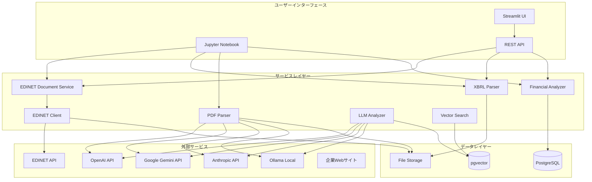
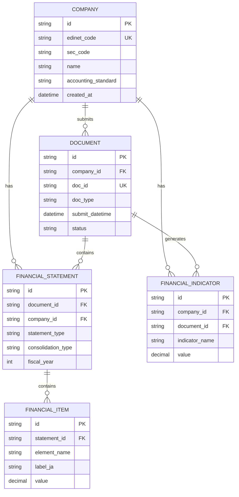
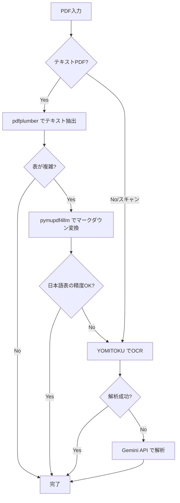
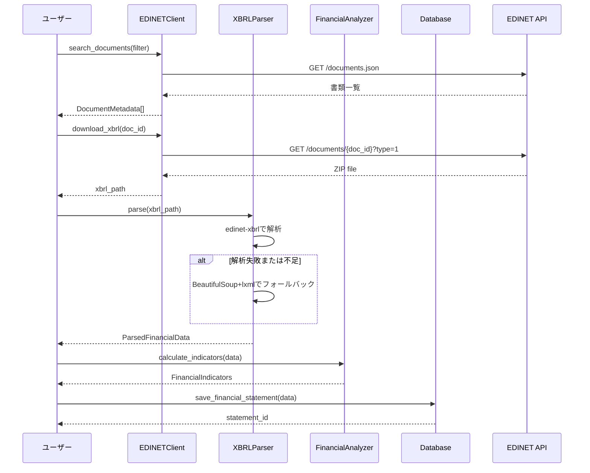
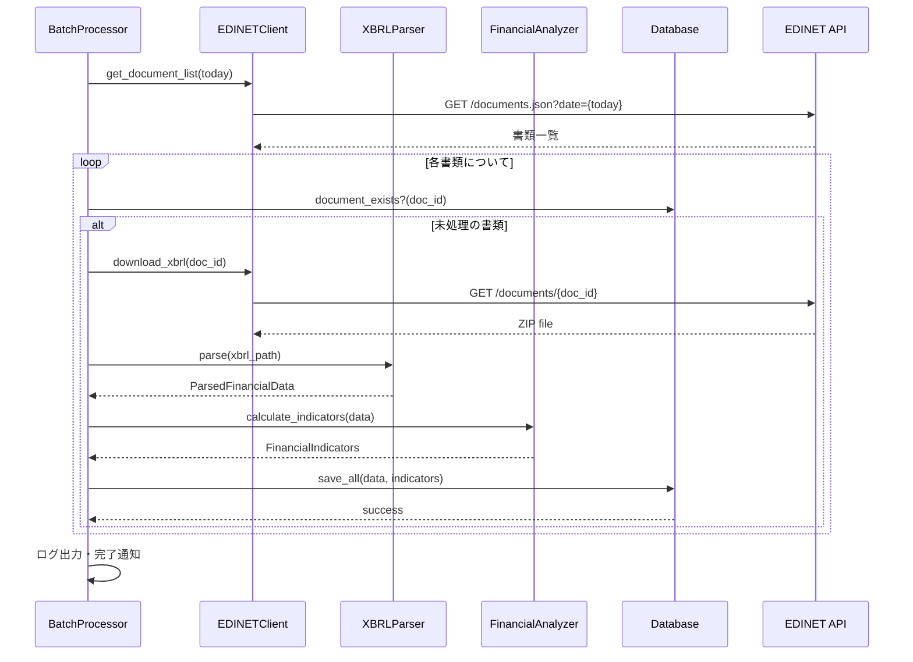
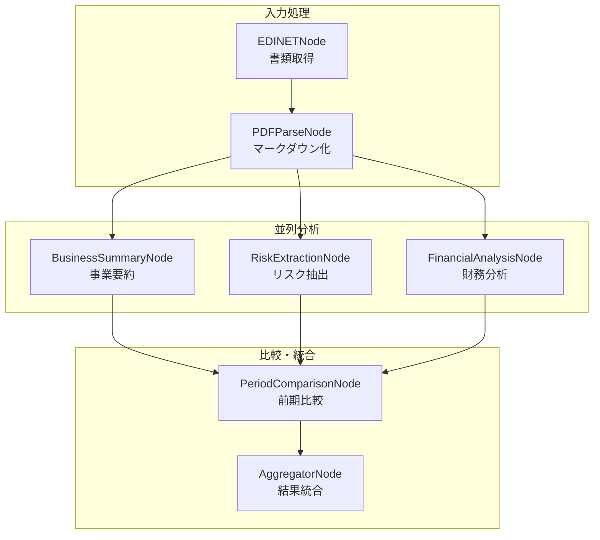

# 機能設計書 (Functional Design Document)

## システム構成図



## 技術スタック

| 分類 | 技術 | 選定理由 |
|------|------|----------|
| 言語 | Python 3.11+ | データ分析エコシステム、型ヒント完備 |
| Webフレームワーク | FastAPI | 高速、型安全、OpenAPI自動生成 |
| PDF解析 | pdfplumber + pymupdf4llm + YOMITOKU | 段階的解析（コスト効率重視） |
| XBRL解析 | edinet-xbrl + BeautifulSoup/lxml | 基本対応 + フォールバック |
| データベース | PostgreSQL 15+ | 安定性、pgvector対応 |
| ベクトル検索 | pgvector | PostgreSQLネイティブ対応 |
| 簡易UI | Streamlit | 高速プロトタイピング |
| テスト | pytest | 標準的なテストフレームワーク |
| 型チェック | mypy | 静的型チェック |
| フォーマッタ | ruff | 高速なLinter/Formatter |

---

## データモデル定義

### エンティティ: Company（企業）

```python
from dataclasses import dataclass
from datetime import datetime

@dataclass
class Company:
    """企業エンティティ"""
    id: str                              # UUID
    edinet_code: str                     # EDINETコード（6桁）
    sec_code: str | None                 # 証券コード（5桁）、未上場はNone
    jcn: str | None                      # 法人番号（13桁）
    name: str                            # 企業名
    name_en: str | None                  # 企業名（英語）
    industry_code: str | None            # 業種コード
    accounting_standard: str | None      # 会計基準（JGAAP/IFRS/US-GAAP）
    fiscal_year_end: str | None          # 決算月（例: "03"）
    created_at: datetime                 # 作成日時
    updated_at: datetime                 # 更新日時
```

**制約**:
- `edinet_code`: 必須、6桁の英数字、一意
- `sec_code`: 5桁の数字、上場企業のみ
- `name`: 必須、1-200文字

### エンティティ: Document（開示書類）

```python
from dataclasses import dataclass
from datetime import datetime, date
from typing import Literal

type DocumentType = Literal[
    "annual_report",        # 有価証券報告書
    "quarterly_report",     # 四半期報告書
    "semiannual_report",    # 半期報告書
    "extraordinary_report", # 臨時報告書
    "securities_registration", # 有価証券届出書
    "other"
]

type DocumentStatus = Literal["pending", "downloaded", "parsed", "failed"]

@dataclass
class Document:
    """開示書類エンティティ"""
    id: str                              # UUID
    company_id: str                      # 企業ID（FK）
    doc_id: str                          # EDINET書類管理番号（8桁）
    doc_type: DocumentType               # 書類種別
    doc_type_code: str                   # 書類種別コード（3桁）
    ordinance_code: str                  # 府令コード（3桁）
    form_code: str                       # 様式コード（6桁）
    period_start: date | None            # 対象期間（開始）
    period_end: date | None              # 対象期間（終了）
    submit_datetime: datetime            # 提出日時
    doc_description: str                 # 書類概要
    withdrawal_status: int               # 取下区分（0:通常, 1:取下書, 2:取り下げ済）
    xbrl_flag: bool                      # XBRL有無
    pdf_flag: bool                       # PDF有無
    csv_flag: bool                       # CSV有無
    status: DocumentStatus               # 処理ステータス
    file_path: str | None                # ダウンロードファイルパス
    created_at: datetime                 # 作成日時
    updated_at: datetime                 # 更新日時
```

**制約**:
- `doc_id`: 必須、8桁、一意
- `company_id`: 必須、Companyテーブルへの外部キー

### エンティティ: FinancialStatement（財務諸表）

```python
from dataclasses import dataclass
from datetime import datetime, date
from decimal import Decimal
from typing import Literal

type StatementType = Literal[
    "balance_sheet",        # 貸借対照表
    "income_statement",     # 損益計算書
    "cash_flow_statement",  # キャッシュフロー計算書
    "statement_of_changes_in_equity"  # 株主資本等変動計算書
]

type ConsolidationType = Literal["consolidated", "non_consolidated"]

@dataclass
class FinancialStatement:
    """財務諸表エンティティ"""
    id: str                              # UUID
    document_id: str                     # 書類ID（FK）
    company_id: str                      # 企業ID（FK）
    statement_type: StatementType        # 財務諸表種別
    consolidation_type: ConsolidationType # 連結/単体
    fiscal_year: int                     # 会計年度
    fiscal_period: str                   # 会計期間（"FY", "Q1", "Q2", "Q3", "H1"）
    period_start: date                   # 対象期間（開始）
    period_end: date                     # 対象期間（終了）
    currency: str                        # 通貨（"JPY"）
    unit_scale: int                      # 単位スケール（0:円, 3:千円, 6:百万円）
    created_at: datetime                 # 作成日時
    updated_at: datetime                 # 更新日時
```

### エンティティ: FinancialItem（財務項目）

```python
from dataclasses import dataclass
from datetime import datetime
from decimal import Decimal

@dataclass
class FinancialItem:
    """財務項目エンティティ"""
    id: str                              # UUID
    statement_id: str                    # 財務諸表ID（FK）
    element_name: str                    # XBRL要素名（例: "jppfs_cor:NetSales"）
    label_ja: str                        # 日本語ラベル（例: "売上高"）
    label_en: str | None                 # 英語ラベル
    value: Decimal                       # 金額（円単位に正規化）
    context_ref: str                     # コンテキスト参照
    is_current_period: bool              # 当期フラグ
    created_at: datetime                 # 作成日時
```

**制約**:
- `value`: 円単位に正規化して保存
- `element_name`: XBRL要素名をそのまま保存

### エンティティ: FinancialIndicator（財務指標）

```python
from dataclasses import dataclass
from datetime import datetime, date
from decimal import Decimal
from typing import Literal

type IndicatorCategory = Literal[
    "profitability",   # 収益性
    "safety",          # 安全性
    "efficiency",      # 効率性
    "growth"           # 成長性
]

@dataclass
class FinancialIndicator:
    """財務指標エンティティ"""
    id: str                              # UUID
    company_id: str                      # 企業ID（FK）
    document_id: str                     # 書類ID（FK）
    fiscal_year: int                     # 会計年度
    fiscal_period: str                   # 会計期間
    period_end: date                     # 対象期間（終了）
    indicator_name: str                  # 指標名（例: "ROE"）
    indicator_category: IndicatorCategory # 指標カテゴリ
    value: Decimal                       # 指標値（%の場合は小数で保存、例: 12.5% → 0.125）
    numerator: Decimal | None            # 分子
    denominator: Decimal | None          # 分母
    created_at: datetime                 # 作成日時
```

### ER図



---

## コンポーネント設計

### EDINETClient（EDINET APIクライアント）

**責務**:
- EDINET APIとの通信
- 書類一覧の取得
- 書類ファイル（ZIP/PDF/XBRL）のダウンロード
- レート制限対応とリトライ処理

**インターフェース**:
```python
from typing import Protocol
from dataclasses import dataclass
from datetime import date
from pathlib import Path

@dataclass
class DocumentSearchParams:
    """書類検索パラメータ"""
    date: date                           # ファイル日付
    include_details: bool = True         # 詳細情報を含む

@dataclass
class DocumentFilter:
    """書類フィルタ"""
    edinet_code: str | None = None       # EDINETコード
    sec_code: str | None = None          # 証券コード
    company_name: str | None = None      # 企業名（部分一致）
    doc_type_codes: list[str] | None = None  # 書類種別コード
    start_date: date | None = None       # 期間（開始）
    end_date: date | None = None         # 期間（終了）

@dataclass
class DocumentMetadata:
    """書類メタデータ"""
    doc_id: str
    edinet_code: str
    sec_code: str | None
    filer_name: str | None
    doc_type_code: str
    doc_description: str | None
    submit_datetime: str | None
    xbrl_flag: bool
    pdf_flag: bool

class EDINETClientProtocol(Protocol):
    """EDINET APIクライアントプロトコル"""

    async def get_document_list(
        self,
        date: date,
        include_details: bool = True
    ) -> DocumentListResponse:
        """書類一覧を取得する（日付単位）"""
        ...

    async def download_document(
        self,
        doc_id: str,
        doc_type: int,
        save_path: Path
    ) -> Path:
        """書類ファイルをダウンロードする

        Args:
            doc_id: 書類管理番号
            doc_type: 1=XBRL(ZIP), 2=PDF, 3=代替書面, 4=英文XBRL, 5=CSV
            save_path: 保存先パス
        """
        ...
```

**依存関係**:
- `httpx`: HTTP通信（非同期対応）
- `tenacity`: リトライ処理

**実装状態**: ✅ 実装完了 (`src/company_research_agent/clients/edinet_client.py`)

### EDINETDocumentService（EDINET書類検索サービス）

**責務**:
- 複数日付を横断した書類検索
- 企業コード、企業名、書類種別によるフィルタリング
- EDINETClientのラッパーとしてビジネスロジックを提供

**インターフェース**:
```python
from typing import Protocol
from dataclasses import dataclass
from datetime import date
from enum import Enum

from company_research_agent.schemas.edinet_schemas import DocumentMetadata

class SearchOrder(str, Enum):
    """検索順序"""
    NEWEST_FIRST = "newest_first"  # 今日から過去へ（デフォルト）
    OLDEST_FIRST = "oldest_first"  # 過去から今日へ

@dataclass
class DocumentFilter:
    """書類検索フィルタ"""
    edinet_code: str | None = None       # EDINETコード（完全一致）
    sec_code: str | None = None          # 証券コード（完全一致）
    company_name: str | None = None      # 企業名（部分一致）
    doc_type_codes: list[str] | None = None  # 書類種別コード（OR条件）
    start_date: date | None = None       # 検索開始日
    end_date: date | None = None         # 検索終了日
    search_order: SearchOrder = SearchOrder.NEWEST_FIRST  # 検索順序
    max_documents: int | None = None     # 取得する書類の最大数（早期終了用）

class EDINETDocumentServiceProtocol(Protocol):
    """EDINET書類検索サービスプロトコル"""

    async def search_documents(
        self,
        filter: DocumentFilter
    ) -> list[DocumentMetadata]:
        """書類を検索する（複数日付を横断、フィルタ適用）

        指定期間の各日付でEDINET APIを呼び出し、
        取得した書類をフィルタ条件で絞り込んで返す。

        検索順序:
        - NEWEST_FIRST（デフォルト）: end_dateからstart_dateへ遡って検索
        - OLDEST_FIRST: start_dateからend_dateへ向かって検索

        早期終了:
        - max_documentsが指定された場合、その件数に達した時点で検索を終了
        - 「最新の有報を1件取得」のような用途に有効

        結果のソート:
        - 結果は常にsubmit_date_timeの降順（最新順）でソートされる
        """
        ...
```

**依存関係**:
- `EDINETClient`: EDINET API通信

**実装状態**: ✅ 実装完了 (`src/company_research_agent/services/edinet_document_service.py`)

### QueryOrchestrator（自然言語クエリ処理）

**責務**:
- ユーザーの自然言語クエリを解釈し、適切なツールを呼び出す
- 期間表現（「過去1年間」「過去半年」など）を具体的な日付範囲に変換
- 検索順序（最新/最古）の自動判定
- ReActエージェントとしてのツール実行制御

**期間表現の解釈**:

システムプロンプトにより、以下の自然言語期間表現を具体的な日付（YYYY-MM-DD形式）に変換:

| ユーザーの表現 | start_date | end_date |
|---------------|------------|----------|
| 「過去1年間」「直近1年」 | 1年前の日付 | 今日 |
| 「過去半年」「直近6ヶ月」 | 6ヶ月前の日付 | 今日 |
| 「過去3年」「直近3年間」 | 3年前の日付 | 今日 |
| 「過去5年」 | 5年前の日付 | 今日 |
| 「2024年1月以降」 | 2024-01-01 | 今日 |
| 「2023年度」 | 2023-04-01 | 2024-03-31 |
| 「今年」 | 今年の1月1日 | 今日 |
| 「去年」「昨年」 | 去年の1月1日 | 去年の12月31日 |
| 期間指定なし | 省略（デフォルト5年） | 省略 |

**使用例**:
```
ユーザー: 「ソニーの過去1年間のすべてのドキュメントを検索して」
→ search_documents(edinet_code="E01777", start_date="2025-01-18", end_date="2026-01-18")

ユーザー: 「トヨタの2024年1月以降の有報を探して」
→ search_documents(edinet_code="E02144", doc_type_codes=["120"], start_date="2024-01-01", end_date="2026-01-18")
```

**依存関係**:
- `LLMProvider`: LLMモデル呼び出し
- `search_documents`, `search_company` 等のLangChainツール

**出力スキーマ**:
```python
class DocumentResultMetadata(BaseModel):
    """分析対象書類のメタデータ"""
    doc_id: str                          # 書類ID（S100XXXX形式）
    filer_name: str | None               # 企業名
    doc_description: str | None          # 書類タイトル
    period_start: str | None             # 対象期間開始日（YYYY-MM-DD）
    period_end: str | None               # 対象期間終了日（YYYY-MM-DD）

class OrchestratorResult(BaseModel):
    """オーケストレーター結果"""
    query: str                           # 元のクエリ
    intent: str                          # 判定された意図（検索/分析/比較/要約）
    result: Any                          # 処理結果
    tools_used: list[str]                # 使用したツール
    documents: list[DocumentResultMetadata]  # 分析対象書類のメタデータ
```

**メタデータ連携**:

`search_documents` で取得した書類メタデータを `analyze_document` に渡すことで、
分析結果にメタデータが含まれる。これにより、どの企業のどの期間の有報を分析したか明確になる。

```python
# analyze_document のメタデータパラメータ
await analyze_document(
    doc_id="S100XXXX",
    filer_name="ソフトバンクグループ株式会社",
    doc_description="有価証券報告書－第45期(2024/04/01－2025/03/31)",
    period_start="2024-04-01",
    period_end="2025-03-31",
)

# 結果
result.documents
# → [DocumentResultMetadata(
#     doc_id="S100XXXX",
#     filer_name="ソフトバンクグループ株式会社",
#     doc_description="有価証券報告書－第45期(2024/04/01－2025/03/31)",
#     period_start="2024-04-01",
#     period_end="2025-03-31"
# )]
```

**実装状態**: ✅ 実装完了 (`src/company_research_agent/orchestrator/query_orchestrator.py`, `src/company_research_agent/prompts/orchestrator_system.py`)

### LLMProvider（マルチLLMプロバイダー）

**責務**:
- 複数LLMプロバイダー（OpenAI, Google, Anthropic, Ollama）の抽象化
- 構造化出力（Structured Output）のサポート
- ビジョン機能（PDF解析）のサポート
- 環境変数によるプロバイダー切り替え

**インターフェース**:
```python
from typing import Protocol, TypeVar
from pydantic import BaseModel

T = TypeVar("T", bound=BaseModel)

class LLMProvider(Protocol):
    """LLMプロバイダーのプロトコル"""

    @property
    def model_name(self) -> str:
        """使用中のモデル名を返す"""
        ...

    @property
    def provider_name(self) -> str:
        """プロバイダー名を返す"""
        ...

    @property
    def supports_vision(self) -> bool:
        """ビジョン機能のサポート有無"""
        ...

    async def ainvoke_structured(
        self,
        prompt: str,
        output_schema: type[T],
    ) -> T:
        """構造化出力でLLM呼び出し

        Args:
            prompt: プロンプト
            output_schema: 出力スキーマ（Pydantic BaseModel）

        Returns:
            スキーマに従った構造化出力

        Raises:
            LLMProviderError: API呼び出しに失敗した場合
        """
        ...

    async def ainvoke_vision(
        self,
        text_prompt: str,
        image_data: bytes,
        mime_type: str = "image/png",
    ) -> str:
        """ビジョン入力でLLM呼び出し（PDF解析用）

        Args:
            text_prompt: テキストプロンプト
            image_data: 画像データ（バイト列）
            mime_type: MIMEタイプ

        Returns:
            LLMの応答テキスト

        Raises:
            LLMProviderError: API呼び出しに失敗した場合
        """
        ...
```

**設定クラス**:
```python
from pydantic_settings import BaseSettings
from pydantic import Field

class LLMConfig(BaseSettings):
    """LLM統合設定"""

    # テキスト分析用
    provider: LLMProviderType = Field(default=LLMProviderType.GOOGLE)
    model: str | None = Field(default=None)

    # ビジョン用（省略時はprovider/modelと同じ）
    vision_provider: LLMProviderType | None = Field(default=None)
    vision_model: str | None = Field(default=None)

    # 共通設定
    timeout: int = Field(default=120)
    max_retries: int = Field(default=3)
    rpm_limit: int = Field(default=60)

    # APIキー
    openai_api_key: str | None = Field(default=None)
    google_api_key: str | None = Field(default=None)
    anthropic_api_key: str | None = Field(default=None)
    ollama_base_url: str = Field(default="http://localhost:11434")

    model_config = SettingsConfigDict(
        env_prefix="LLM_",
        env_file=".env",
    )
```

**ファクトリー関数**:
```python
from company_research_agent.llm import (
    create_llm_provider,
    get_default_provider,
    get_vision_provider,
)

# 環境変数から自動設定
provider = get_default_provider()
vision_provider = get_vision_provider()

# 明示的な設定
config = LLMConfig(provider=LLMProviderType.OPENAI, model="gpt-4o")
provider = create_llm_provider(config)
```

**対応プロバイダー**:
| プロバイダー | テキスト用デフォルト | ビジョン用デフォルト |
|-------------|---------------------|---------------------|
| OpenAI | gpt-4o | gpt-4o |
| Google | gemini-2.5-flash-preview-05-20 | 同左 |
| Anthropic | claude-sonnet-4-20250514 | 同左 |
| Ollama | llama3.2 | llava |

**依存関係**:
- `langchain-google-genai`: Google Gemini API連携
- `langchain-openai`: OpenAI API連携
- `langchain-anthropic`: Anthropic API連携
- `langchain-ollama`: Ollama連携
- `tenacity`: リトライ処理

**実装状態**: ✅ 実装完了 (`src/company_research_agent/llm/`)

### VisionLLMClient（PDF解析用ビジョンクライアント）

**責務**:
- PDFからのテキスト抽出（Vision機能を使用）
- 任意のビジョン対応LLMプロバイダーでのPDF解析
- レート制限対応とリトライ処理

**インターフェース**:
```python
from pathlib import Path

class VisionLLMClient:
    """PDF解析用のビジョンLLMクライアント"""

    def __init__(
        self,
        provider: LLMProvider | None = None,
        rpm_limit: int = 60,
    ) -> None:
        """クライアントを初期化する

        Args:
            provider: LLMプロバイダー（省略時はget_vision_provider()を使用）
            rpm_limit: レート制限（RPM）
        """
        ...

    def extract_pdf_to_markdown(
        self,
        pdf_path: Path,
        start_page: int | None = None,
        end_page: int | None = None,
    ) -> str:
        """PDFからテキストを抽出してマークダウン形式で返す

        Args:
            pdf_path: PDFファイルのパス
            start_page: 開始ページ（1-based）
            end_page: 終了ページ（1-based）

        Returns:
            マークダウン形式のテキスト

        Raises:
            LLMProviderError: API呼び出しに失敗した場合
        """
        ...
```

**依存関係**:
- `LLMProvider`: LLMプロバイダー抽象化レイヤー
- `PyMuPDF (fitz)`: PDF→画像変換
- `tenacity`: リトライ処理

**実装状態**: ✅ 実装完了 (`src/company_research_agent/clients/vision_client.py`)

### XBRLParser（XBRL解析）

**責務**:
- XBRLファイルの解析
- 財務三表（BS/PL/CF）のデータ抽出
- コンテキスト（期間、連結/単体）の解析
- 複数要素名候補によるフォールバック

**インターフェース**:
```python
from typing import Protocol
from dataclasses import dataclass
from decimal import Decimal
from pathlib import Path
import pandas as pd

@dataclass
class ParsedFinancialData:
    """解析された財務データ"""
    company_info: dict                   # 企業情報
    balance_sheet: pd.DataFrame          # 貸借対照表
    income_statement: pd.DataFrame       # 損益計算書
    cash_flow_statement: pd.DataFrame    # キャッシュフロー計算書
    metadata: dict                       # メタデータ（期間、連結/単体等）

@dataclass
class XBRLParseOptions:
    """XBRL解析オプション"""
    consolidation_type: str = "consolidated"  # "consolidated" or "non_consolidated"
    include_prior_period: bool = True    # 前期データを含む
    normalize_unit: bool = True          # 金額を円単位に正規化

class XBRLParserProtocol(Protocol):
    """XBRL解析プロトコル"""

    def parse(
        self,
        xbrl_path: Path,
        options: XBRLParseOptions | None = None
    ) -> ParsedFinancialData:
        """XBRLファイルを解析する"""
        ...

    def extract_element(
        self,
        xbrl_path: Path,
        element_names: list[str],
        context_pattern: str | None = None
    ) -> Decimal | None:
        """特定の要素を抽出する（フォールバック対応）"""
        ...
```

**依存関係**:
- `edinet-xbrl`: 基本的なXBRL解析
- `beautifulsoup4` + `lxml`: フォールバック解析
- `pandas`: データフレーム変換

**実装戦略**:
1. まず`edinet-xbrl`で解析を試行
2. 失敗または不足データがある場合、`BeautifulSoup + lxml`でフォールバック
3. 複数の要素名候補を順番に試行

### PDFParser（PDF解析）

**責務**:
- PDFファイルからのテキスト抽出
- 表データのマークダウン変換
- 段階的な解析戦略によるコスト最適化

**段階的解析戦略**:

| 段階 | ライブラリ | 用途 | コスト |
|------|-----------|------|--------|
| 1. 基本 | pdfplumber | テキスト抽出、シンプルな表 | 無料 |
| 2. 中間 | pymupdf4llm | マークダウン変換、構造化 | 無料 |
| 3. 高精度 | YOMITOKU | 複雑な日本語表、スキャンPDF | 無料 |
| 4. 最終手段 | Gemini API | 上記で解析困難な場合 | API課金 |



**インターフェース**:
```python
from typing import Protocol, Literal
from dataclasses import dataclass
from pathlib import Path

type ParseStrategy = Literal["auto", "pdfplumber", "pymupdf4llm", "yomitoku", "gemini"]

@dataclass
class ParsedPDFContent:
    """解析されたPDFコンテンツ"""
    text: str                            # 抽出されたテキスト
    tables: list[str]                    # マークダウン形式の表
    pages: int                           # ページ数
    metadata: dict                       # メタデータ
    strategy_used: ParseStrategy         # 使用された解析戦略

@dataclass
class PDFParseOptions:
    """PDF解析オプション"""
    start_page: int | None = None        # 開始ページ
    end_page: int | None = None          # 終了ページ
    extract_tables: bool = True          # 表を抽出する
    strategy: ParseStrategy = "auto"     # 解析戦略（auto=段階的に試行）
    fallback_to_gemini: bool = False     # Gemini APIへのフォールバックを許可

class PDFParserProtocol(Protocol):
    """PDF解析プロトコル"""

    def parse(
        self,
        pdf_path: Path,
        options: PDFParseOptions | None = None
    ) -> ParsedPDFContent:
        """PDFファイルを解析する"""
        ...

    def extract_tables(
        self,
        pdf_path: Path,
        page_numbers: list[int] | None = None
    ) -> list[str]:
        """表をマークダウン形式で抽出する"""
        ...

    def get_info(
        self,
        pdf_path: Path
    ) -> dict:
        """PDFのメタデータを取得する（ページ数、目次等）"""
        ...
```

**依存関係**:
- `pdfplumber`: 基本的なPDF処理（テキスト抽出、シンプルな表）
- `pymupdf4llm`: マークダウン変換（pymupdf/fitz ベース）
- `yomitoku`: 日本語OCR（複雑な表、スキャンPDF）
- `VisionLLMClient`: ビジョンLLM（最終手段、マルチプロバイダー対応）

**実装状態**: ✅ 実装完了 (`src/company_research_agent/parsers/pdf_parser.py`)

### FinancialAnalyzer（財務分析）

**責務**:
- 財務指標の計算
- 指標の正規化と検証
- 計算結果のDataFrame変換

**インターフェース**:
```python
from typing import Protocol
from dataclasses import dataclass
from decimal import Decimal
import pandas as pd

@dataclass
class FinancialIndicators:
    """財務指標"""
    # 収益性指標
    roe: Decimal | None                  # 自己資本利益率
    roa: Decimal | None                  # 総資産利益率
    operating_margin: Decimal | None     # 営業利益率
    ordinary_margin: Decimal | None      # 経常利益率
    net_profit_margin: Decimal | None    # 売上高純利益率

    # 安全性指標
    equity_ratio: Decimal | None         # 自己資本比率
    current_ratio: Decimal | None        # 流動比率
    fixed_ratio: Decimal | None          # 固定比率
    debt_ratio: Decimal | None           # 負債比率

    # 効率性指標
    total_asset_turnover: Decimal | None # 総資産回転率
    inventory_turnover: Decimal | None   # 棚卸資産回転率
    receivables_turnover: Decimal | None # 売上債権回転率

class FinancialAnalyzerProtocol(Protocol):
    """財務分析プロトコル"""

    def calculate_indicators(
        self,
        financial_data: ParsedFinancialData
    ) -> FinancialIndicators:
        """財務指標を計算する"""
        ...

    def to_dataframe(
        self,
        indicators: FinancialIndicators
    ) -> pd.DataFrame:
        """指標をDataFrameに変換する"""
        ...

    def compare_periods(
        self,
        current: FinancialIndicators,
        prior: FinancialIndicators
    ) -> pd.DataFrame:
        """期間比較を行う"""
        ...
```

**依存関係**:
- `pandas`: データフレーム処理
- `decimal`: 高精度計算

### Database（データベース）

**責務**:
- PostgreSQLへのデータ保存・取得
- トランザクション管理
- 重複排除と冪等性の担保

**インターフェース**:
```python
from typing import Protocol
from dataclasses import dataclass

class DatabaseProtocol(Protocol):
    """データベースプロトコル"""

    def save_company(self, company: Company) -> str:
        """企業を保存する（upsert）"""
        ...

    def save_document(self, document: Document) -> str:
        """書類を保存する（upsert）"""
        ...

    def save_financial_statement(
        self,
        statement: FinancialStatement,
        items: list[FinancialItem]
    ) -> str:
        """財務諸表と項目を保存する"""
        ...

    def save_indicators(
        self,
        indicators: list[FinancialIndicator]
    ) -> None:
        """財務指標を保存する"""
        ...

    def get_company_by_code(
        self,
        edinet_code: str | None = None,
        sec_code: str | None = None
    ) -> Company | None:
        """企業を取得する"""
        ...

    def get_financial_history(
        self,
        company_id: str,
        years: int = 5
    ) -> list[FinancialStatement]:
        """財務履歴を取得する"""
        ...
```

**依存関係**:
- `sqlalchemy`: ORM
- `asyncpg` または `psycopg`: PostgreSQL接続

---

## ユースケース図

### ユースケース1: 企業の財務データ取得



**フロー説明**:
1. ユーザーがフィルタ条件を指定して書類を検索
2. EDINET APIから書類一覧を取得
3. 目的の書類のXBRLファイルをダウンロード
4. XBRLParserで財務データを解析（edinet-xbrl優先、フォールバックあり）
5. FinancialAnalyzerで財務指標を計算
6. 結果をデータベースに保存

### ユースケース2: 日次バッチ処理



**フロー説明**:
1. 当日の書類一覧を取得
2. 各書類について未処理かチェック
3. 未処理の書類のみダウンロード・解析・保存
4. 処理完了をログ出力

---

## アルゴリズム設計

### 財務指標計算アルゴリズム

**目的**: 抽出した財務データから主要な財務指標を計算する

#### 収益性指標

##### ROE（自己資本利益率）

**計算式**:
```
ROE = 当期純利益 / 自己資本 × 100
```

**実装**:
```python
def calculate_roe(
    net_income: Decimal,
    equity: Decimal
) -> Decimal | None:
    """ROEを計算する"""
    if equity == 0:
        return None
    return (net_income / equity) * 100
```

##### ROA（総資産利益率）

**計算式**:
```
ROA = 当期純利益 / 総資産 × 100
```

**実装**:
```python
def calculate_roa(
    net_income: Decimal,
    total_assets: Decimal
) -> Decimal | None:
    """ROAを計算する"""
    if total_assets == 0:
        return None
    return (net_income / total_assets) * 100
```

##### 営業利益率

**計算式**:
```
営業利益率 = 営業利益 / 売上高 × 100
```

**実装**:
```python
def calculate_operating_margin(
    operating_income: Decimal,
    net_sales: Decimal
) -> Decimal | None:
    """営業利益率を計算する"""
    if net_sales == 0:
        return None
    return (operating_income / net_sales) * 100
```

#### 安全性指標

##### 自己資本比率

**計算式**:
```
自己資本比率 = 自己資本 / 総資産 × 100
```

**実装**:
```python
def calculate_equity_ratio(
    equity: Decimal,
    total_assets: Decimal
) -> Decimal | None:
    """自己資本比率を計算する"""
    if total_assets == 0:
        return None
    return (equity / total_assets) * 100
```

##### 流動比率

**計算式**:
```
流動比率 = 流動資産 / 流動負債 × 100
```

**実装**:
```python
def calculate_current_ratio(
    current_assets: Decimal,
    current_liabilities: Decimal
) -> Decimal | None:
    """流動比率を計算する"""
    if current_liabilities == 0:
        return None
    return (current_assets / current_liabilities) * 100
```

#### 効率性指標

##### 総資産回転率

**計算式**:
```
総資産回転率 = 売上高 / 総資産
```

**実装**:
```python
def calculate_total_asset_turnover(
    net_sales: Decimal,
    total_assets: Decimal
) -> Decimal | None:
    """総資産回転率を計算する"""
    if total_assets == 0:
        return None
    return net_sales / total_assets
```

### XBRL要素名フォールバックアルゴリズム

**目的**: 企業や会計基準により異なる要素名に対応する

**計算ロジック**:

```python
# 売上高の要素名候補
NET_SALES_CANDIDATES = [
    "jppfs_cor:NetSales",           # 日本基準・一般
    "jppfs_cor:Revenue",            # 日本基準・一部企業
    "jpigp_cor:Revenue",            # IFRS
    "jppfs_cor:OperatingRevenue",   # 金融業等
    "jppfs_cor:OrdinaryRevenues",   # 保険業
]

def extract_net_sales(
    soup: BeautifulSoup,
    context_pattern: str = r"CurrentYear.*Duration"
) -> Decimal | None:
    """売上高を抽出する（フォールバック対応）"""
    for element_name in NET_SALES_CANDIDATES:
        tags = soup.find_all('ix:nonfraction', attrs={'name': element_name})
        for tag in tags:
            context_ref = tag.get('contextRef', '')
            if re.search(context_pattern, context_ref):
                value = parse_numeric_value(tag)
                if value is not None:
                    return value
    return None

def parse_numeric_value(tag) -> Decimal | None:
    """ix:nonfractionタグから数値を正しく取得する"""
    try:
        value_text = tag.get_text().replace(',', '').strip()
        value = Decimal(value_text)

        # scale属性の処理
        scale = tag.get('scale')
        if scale:
            value *= Decimal(10) ** int(scale)

        # sign属性の処理（負数）
        sign = tag.get('sign')
        if sign == '-':
            value *= -1

        return value
    except (ValueError, InvalidOperation):
        return None
```

---

## API設計

### REST API エンドポイント

#### 書類検索

```
GET /api/v1/documents
```

**クエリパラメータ**:
| パラメータ | 型 | 必須 | 説明 |
|-----------|-----|------|------|
| edinet_code | string | No | EDINETコード |
| sec_code | string | No | 証券コード |
| company_name | string | No | 企業名（部分一致） |
| doc_type | string | No | 書類種別（annual_report等） |
| start_date | date | No | 期間（開始） |
| end_date | date | No | 期間（終了） |

**レスポンス**:
```json
{
  "documents": [
    {
      "doc_id": "S100XXXX",
      "edinet_code": "E10001",
      "sec_code": "7203",
      "filer_name": "トヨタ自動車株式会社",
      "doc_type": "annual_report",
      "doc_description": "有価証券報告書－第120期",
      "submit_datetime": "2024-06-25T15:30:00",
      "xbrl_flag": true,
      "pdf_flag": true
    }
  ],
  "total": 1
}
```

#### 財務データ取得

```
GET /api/v1/companies/{edinet_code}/financials
```

**パスパラメータ**:
| パラメータ | 型 | 必須 | 説明 |
|-----------|-----|------|------|
| edinet_code | string | Yes | EDINETコード |

**クエリパラメータ**:
| パラメータ | 型 | 必須 | 説明 |
|-----------|-----|------|------|
| fiscal_year | int | No | 会計年度 |
| consolidation | string | No | consolidated/non_consolidated |

**レスポンス**:
```json
{
  "company": {
    "edinet_code": "E10001",
    "sec_code": "7203",
    "name": "トヨタ自動車株式会社"
  },
  "fiscal_year": 2024,
  "consolidation_type": "consolidated",
  "balance_sheet": {
    "total_assets": 90000000000000,
    "current_assets": 30000000000000,
    "noncurrent_assets": 60000000000000,
    "total_liabilities": 50000000000000,
    "net_assets": 40000000000000
  },
  "income_statement": {
    "net_sales": 45000000000000,
    "operating_income": 3500000000000,
    "ordinary_income": 4000000000000,
    "net_income": 2800000000000
  },
  "indicators": {
    "roe": 7.0,
    "roa": 3.1,
    "operating_margin": 7.8,
    "equity_ratio": 44.4
  }
}
```

**エラーレスポンス**:
- 400 Bad Request: パラメータが不正な場合
- 404 Not Found: 企業が見つからない場合
- 500 Internal Server Error: サーバーエラー

---

## エラーハンドリング

### エラーの分類

| エラー種別 | 処理 | ユーザーへの表示 |
|-----------|------|-----------------|
| EDINET API エラー（401） | リトライ不可、処理中断 | "EDINET APIキーが無効です。.envファイルのEDINET_API_KEYを確認してください" |
| EDINET API エラー（404） | スキップ、ログ記録 | "書類が見つかりません (doc_id: {id})" |
| EDINET API エラー（500） | リトライ（3回まで） | "EDINET APIが一時的に利用できません。再試行中..." |
| XBRL解析エラー | フォールバック試行 | "XBRL解析に失敗しました。フォールバック処理を試行中..." |
| 要素が見つからない | Noneを返す、ログ記録 | "売上高データが見つかりません" |
| 計算エラー（ゼロ除算） | Noneを返す | "ROEを計算できません（自己資本がゼロ）" |
| データベースエラー | ロールバック、リトライ | "データの保存に失敗しました。再試行中..." |

### カスタム例外クラス

```python
class EDINETAssistantError(Exception):
    """基底例外クラス"""
    pass

class EDINETAPIError(EDINETAssistantError):
    """EDINET API関連のエラー"""
    def __init__(self, status_code: int, message: str):
        self.status_code = status_code
        self.message = message
        super().__init__(f"EDINET API Error ({status_code}): {message}")

class XBRLParseError(EDINETAssistantError):
    """XBRL解析エラー"""
    pass

class FinancialCalculationError(EDINETAssistantError):
    """財務計算エラー"""
    pass

class DatabaseError(EDINETAssistantError):
    """データベースエラー"""
    pass
```

---

## パフォーマンス最適化

- **EDINET API呼び出し**: セッション（requests.Session）を使い回し、接続のオーバーヘッドを削減
- **バッチ処理**: 書類ダウンロードを並列化（concurrent.futures使用、同時接続数制限あり）
- **XBRL解析**: lxmlのiterparseを使用し、メモリ効率を向上（大きなファイル対応）
- **データベース**: バルクインサートを使用、インデックスの最適化
- **キャッシュ**: EDINETコードリストをメモリキャッシュ

---

## セキュリティ考慮事項

- **APIキー管理**: 環境変数または設定ファイル（.env）で管理、ソースコードにハードコードしない
- **データベース接続**: SSL接続を推奨、接続文字列の暗号化
- **ログ出力**: APIキー、認証情報をログに出力しない
- **入力検証**: ユーザー入力（企業コード等）のバリデーション
- **ファイル操作**: パストラバーサル攻撃の防止

---

## テスト戦略

### ユニットテスト

- **XBRLParser**: 各財務項目の抽出ロジック、フォールバック処理
- **FinancialAnalyzer**: 各財務指標の計算ロジック、エッジケース（ゼロ除算等）
- **EDINETClient**: レスポンスのパース、エラーハンドリング
- **LLMモジュール**: プロバイダー抽象化レイヤー ✅ 実装済（106テスト）
  - LLMProviderType enum（8テスト）
  - LLMConfig設定クラス（22テスト）
  - ファクトリーメソッド（18テスト）
  - 各プロバイダー初期化・設定・ビジョン機能（58テスト）

### 統合テスト

- **EDINET API連携**: 実際のAPIを使用した書類取得（テスト用書類）
- **データベース**: CRUD操作、トランザクション処理
- **エンドツーエンド**: 検索→ダウンロード→解析→保存の一連のフロー

### E2Eテスト

- **実企業データ**: 10社程度の実データでの動作確認
- **異なる会計基準**: 日本基準、IFRS企業でのテスト
- **異なる業種**: 製造業、金融業、サービス業でのテスト

---

## LangGraphワークフロー設計

### ワークフロー概要

有価証券報告書のLLM分析機能をLangGraphで構造化し、各分析機能をノードとして実装する。
並列実行と個別出力・統合レポートの両方に対応する。

### ワークフロー構成図



### ノード一覧

| ノード名 | 責務 | 依存 | 入力 | 出力 |
|---------|------|------|------|------|
| `EDINETNode` | EDINET書類取得 | EDINETClient | doc_id | pdf_path |
| `PDFParseNode` | PDF解析・マークダウン化 | PDFParser, VisionLLMClient | pdf_path | markdown_content |
| `BusinessSummaryNode` | 事業要約・戦略分析 | LLMProvider | markdown_content | BusinessSummary |
| `RiskExtractionNode` | リスク要因抽出・分類 | LLMProvider | markdown_content | RiskAnalysis |
| `FinancialAnalysisNode` | 財務状況・業績分析 | LLMProvider | markdown_content | FinancialAnalysis |
| `PeriodComparisonNode` | 前期との比較分析 | LLMProvider | current/prior markdown | PeriodComparison |
| `AggregatorNode` | 結果統合・レポート生成 | LLMProvider | 全分析結果 | ComprehensiveReport |

### State設計

```python
from typing import TypedDict
from pydantic import BaseModel

class AnalysisState(TypedDict):
    """LLM分析ワークフローの状態"""
    # 入力
    doc_id: str
    prior_doc_id: str | None

    # 中間結果（PDFパス）
    pdf_path: str | None
    prior_pdf_path: str | None

    # 中間結果（マークダウン）
    markdown_content: str | None
    prior_markdown_content: str | None

    # 個別出力（各ノードの結果）
    business_summary: BusinessSummary | None
    risk_analysis: RiskAnalysis | None
    financial_analysis: FinancialAnalysis | None
    period_comparison: PeriodComparison | None

    # 統合出力
    comprehensive_report: ComprehensiveReport | None

    # メタデータ
    errors: list[str]
    completed_nodes: list[str]
```

### 出力スキーマ

#### BusinessSummary（事業要約）

```python
class BusinessSummary(BaseModel):
    """事業要約の出力スキーマ"""
    company_name: str                    # 企業名
    fiscal_year: str                     # 対象会計年度
    business_description: str            # 事業概要
    main_products_services: list[str]    # 主要製品・サービス
    business_segments: list[BusinessSegment]  # 事業セグメント
    competitive_advantages: list[str]    # 競争優位性
    growth_strategy: str                 # 成長戦略
    key_initiatives: list[str]           # 重点施策
```

#### RiskAnalysis（リスク分析）

```python
class RiskItem(BaseModel):
    """リスク項目"""
    category: str                        # リスクカテゴリ（市場、規制、財務等）
    title: str                           # リスクタイトル
    description: str                     # リスク説明
    severity: str                        # 重要度（高/中/低）
    mitigation: str | None               # 対策

class RiskAnalysis(BaseModel):
    """リスク分析の出力スキーマ"""
    risks: list[RiskItem]                # リスク一覧
    new_risks: list[str]                 # 新規リスク（前期比較時）
    risk_summary: str                    # リスク総括
```

#### FinancialAnalysis（財務分析）

```python
class FinancialHighlight(BaseModel):
    """財務ハイライト"""
    metric_name: str                     # 指標名
    current_value: str                   # 当期値
    prior_value: str | None              # 前期値
    change_rate: str | None              # 増減率
    comment: str                         # コメント

class FinancialAnalysis(BaseModel):
    """財務分析の出力スキーマ"""
    revenue_analysis: str                # 売上分析
    profit_analysis: str                 # 利益分析
    cash_flow_analysis: str              # キャッシュフロー分析
    financial_position: str              # 財政状態
    highlights: list[FinancialHighlight] # ハイライト
    outlook: str                         # 今後の見通し
```

#### PeriodComparison（前期比較）

```python
class ChangePoint(BaseModel):
    """変化点"""
    category: str                        # カテゴリ（事業、財務、リスク等）
    title: str                           # 変化タイトル
    prior_state: str                     # 前期の状態
    current_state: str                   # 当期の状態
    significance: str                    # 重要度（高/中/低）
    implication: str                     # 示唆

class PeriodComparison(BaseModel):
    """前期比較の出力スキーマ"""
    change_points: list[ChangePoint]     # 変化点一覧
    new_developments: list[str]          # 新規展開事項
    discontinued_items: list[str]        # 終了・中止事項
    overall_assessment: str              # 総合評価
```

#### ComprehensiveReport（統合レポート）

```python
class ComprehensiveReport(BaseModel):
    """統合レポートの出力スキーマ"""
    executive_summary: str               # エグゼクティブサマリー
    business_summary: BusinessSummary    # 事業要約
    risk_analysis: RiskAnalysis          # リスク分析
    financial_analysis: FinancialAnalysis # 財務分析
    period_comparison: PeriodComparison | None  # 前期比較（オプション）
    investment_highlights: list[str]     # 投資ハイライト
    concerns: list[str]                  # 懸念事項
    generated_at: datetime               # 生成日時
```

### ノード基底クラス

```python
from abc import ABC, abstractmethod
from typing import TypeVar, Generic

T = TypeVar('T')

class AnalysisNode(ABC, Generic[T]):
    """分析ノードの基底クラス"""

    @property
    @abstractmethod
    def name(self) -> str:
        """ノード名を返す"""
        ...

    @abstractmethod
    async def execute(self, state: AnalysisState) -> T:
        """ノードを実行する"""
        ...

    async def __call__(self, state: AnalysisState) -> dict:
        """LangGraphから呼び出されるエントリーポイント

        各ノードの開始/完了時にプログレスログを出力する。
        """
        from company_research_agent.core.progress import (
            print_node_start,
            print_node_complete,
        )

        print_node_start(self.name)  # 「▷ ノード: xxx を実行中...」
        try:
            result = await self.execute(state)
            update = self._update_state(state, result)
            update.setdefault("completed_nodes", []).append(self.name)
            print_node_complete(self.name, success=True)  # 「✓ ノード: xxx 完了」
            return update
        except Exception as e:
            print_node_complete(self.name, success=False)  # 「✗ ノード: xxx 失敗」
            return self._handle_error(state, e)

    @abstractmethod
    def _update_state(self, state: AnalysisState, result: T) -> dict:
        """実行結果でStateを更新する"""
        ...

    def _handle_error(self, state: AnalysisState, error: Exception) -> dict:
        """エラーハンドリング"""
        errors = state.get("errors", [])
        errors.append(f"{self.name}: {str(error)}")
        return {"errors": errors}
```

**ログ出力関数** (`src/company_research_agent/core/progress.py`):
```python
def print_node_start(node_name: str) -> None:
    """グラフノード開始ログ（インデント付き、dim表示）"""
    console.print(f"  [dim]▷[/dim] ノード: {node_name} を実行中...")

def print_node_complete(node_name: str, success: bool = True) -> None:
    """グラフノード完了ログ（インデント付き）"""
    if success:
        console.print(f"  [green]✓[/green] ノード: {node_name} 完了")
    else:
        console.print(f"  [red]✗[/red] ノード: {node_name} 失敗")
```

### グラフ構築

```python
from langgraph.graph import StateGraph, END

def build_analysis_graph() -> StateGraph:
    """分析ワークフローのグラフを構築する"""
    graph = StateGraph(AnalysisState)

    # ノード追加
    graph.add_node("edinet", EDINETNode())
    graph.add_node("pdf_parse", PDFParseNode())
    graph.add_node("business_summary", BusinessSummaryNode())
    graph.add_node("risk_extraction", RiskExtractionNode())
    graph.add_node("financial_analysis", FinancialAnalysisNode())
    graph.add_node("period_comparison", PeriodComparisonNode())
    graph.add_node("aggregator", AggregatorNode())

    # エッジ追加（順次処理）
    graph.add_edge("edinet", "pdf_parse")

    # 並列処理の分岐
    graph.add_edge("pdf_parse", "business_summary")
    graph.add_edge("pdf_parse", "risk_extraction")
    graph.add_edge("pdf_parse", "financial_analysis")

    # 並列処理の合流
    graph.add_edge("business_summary", "period_comparison")
    graph.add_edge("risk_extraction", "period_comparison")
    graph.add_edge("financial_analysis", "period_comparison")

    # 最終処理
    graph.add_edge("period_comparison", "aggregator")
    graph.add_edge("aggregator", END)

    # エントリーポイント
    graph.set_entry_point("edinet")

    return graph.compile()
```

### 使用例

#### 個別ノード実行

```python
from company_research_agent.workflows import AnalysisGraph

# デフォルトのLLMプロバイダーを使用（環境変数から設定）
graph = AnalysisGraph()

# 個別ノード実行（事業要約のみ）
summary = await graph.run_node("business_summary", doc_id="S100...")

# 個別ノード実行（リスク抽出のみ）
risks = await graph.run_node("risk_extraction", doc_id="S100...")
```

#### プロバイダー指定で実行

```python
from company_research_agent.llm import get_default_provider, create_llm_provider
from company_research_agent.llm.config import LLMConfig
from company_research_agent.llm.types import LLMProviderType

# 環境変数から自動設定
provider = get_default_provider()
graph = AnalysisGraph(llm_provider=provider)

# 明示的にプロバイダーを指定
config = LLMConfig(provider=LLMProviderType.ANTHROPIC, model="claude-sonnet-4-20250514")
provider = create_llm_provider(config)
graph = AnalysisGraph(llm_provider=provider)
```

#### 全ワークフロー実行

```python
# 全ワークフロー実行
result = await graph.run_full_analysis(
    doc_id="S100...",
    prior_doc_id="S100..."  # 前期比較用（オプション）
)

# 個別結果へのアクセス
print(result.business_summary)
print(result.risk_analysis)
print(result.financial_analysis)
print(result.period_comparison)
print(result.comprehensive_report)  # 統合レポート
```

### ファイル構成

```
src/company_research_agent/
├── llm/                          # LLMプロバイダー抽象化レイヤー ✅ 実装済
│   ├── __init__.py
│   ├── types.py                 # LLMProviderType enum
│   ├── config.py                # LLMConfig設定クラス
│   ├── provider.py              # LLMProviderプロトコル
│   ├── factory.py               # create_llm_provider(), get_default_provider()
│   └── providers/
│       ├── __init__.py
│       ├── base.py              # BaseLLMProvider基底クラス
│       ├── openai.py            # OpenAIProvider
│       ├── google.py            # GoogleProvider
│       ├── anthropic.py         # AnthropicProvider
│       └── ollama.py            # OllamaProvider
├── clients/
│   └── vision_client.py         # VisionLLMClient（PDF解析用）✅ 実装済
├── workflows/                    # LangGraphワークフロー
│   ├── __init__.py
│   ├── state.py                 # AnalysisState定義
│   ├── graph.py                 # グラフ構築・実行
│   └── nodes/                   # 各ノード実装
│       ├── __init__.py
│       ├── base.py              # ノード基底クラス
│       ├── edinet_node.py       # EDINET書類取得
│       ├── pdf_parse_node.py    # PDF解析
│       ├── business_summary_node.py   # 事業要約
│       ├── risk_extraction_node.py    # リスク抽出
│       ├── financial_analysis_node.py # 財務分析
│       ├── period_comparison_node.py  # 前期比較
│       └── aggregator_node.py   # 結果統合
├── schemas/
│   └── llm_analysis.py          # 分析結果スキーマ
└── prompts/                     # プロンプトテンプレート
    ├── __init__.py
    ├── business_summary.py
    ├── risk_extraction.py
    ├── financial_analysis.py
    └── period_comparison.py
```

---

**作成日**: 2026年1月16日
**更新日**: 2026年1月18日
**バージョン**: 1.5
**ステータス**: 実装完了（ノード実行ログ、OrchestratorResultメタデータ追加）
