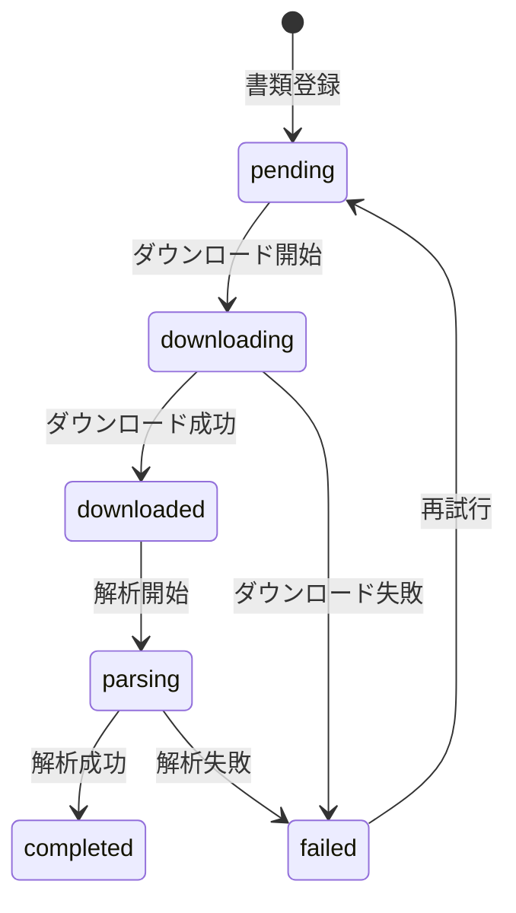

# プロジェクト用語集 (Glossary)

## 概要

このドキュメントは、Company Research Agentプロジェクト内で使用される用語の定義を管理します。

**更新日**: 2026-01-16

---

## ドメイン用語

プロジェクト固有のビジネス概念や機能に関する用語。

### EDINET (エディネット)

**定義**: Electronic Disclosure for Investors' NETwork の略。金融庁が運営する有価証券報告書等の開示書類に関する電子開示システム。

**説明**: 上場企業は有価証券報告書、四半期報告書、臨時報告書などをEDINETを通じて電子的に提出する義務があります。一般投資家はこのシステムを通じて開示書類を閲覧できます。

**関連用語**: [TDnet](#tdnet), [有価証券報告書](#有価証券報告書), [EDINETコード](#edinetコード)

**使用例**:
- 「EDINET APIを使用して書類一覧を取得する」
- 「EDINETから有価証券報告書をダウンロードする」

**公式サイト**: https://disclosure2.edinet-fsa.go.jp/

**英語表記**: Electronic Disclosure for Investors' NETwork

### TDnet (ティーディーネット)

**定義**: Timely Disclosure network の略。東京証券取引所が運営する適時開示情報伝達システム。

**説明**: 決算短信や適時開示資料を配信するシステム。EDINETとは別に運営されており、本プロジェクトではP2（将来機能）として位置づけられています。

**関連用語**: [EDINET](#edinet-エディネット)

**使用例**:
- 「TDnetで決算短信を検索する」

**公式サイト**: https://www.release.tdnet.info/

**英語表記**: Timely Disclosure network

### EDINETコード

**定義**: EDINET上で企業を一意に識別するコード。「E」+ 5桁の数字で構成される。

**説明**: 各企業に割り当てられる固有のコード。証券コードとは別に存在し、上場企業以外（非上場の金融機関等）にも付与されます。

**関連用語**: [証券コード](#証券コード), [EDINET](#edinet-エディネット)

**使用例**:
- 「EDINETコード E00001 の企業情報を取得する」
- 「EDINETコードから証券コードへの変換を行う」

**フォーマット**: `E[0-9]{5}` (例: E00001, E12345)

**データモデル**: `Company.edinet_code`

**英語表記**: EDINET Code

### 証券コード

**定義**: 東京証券取引所が割り当てる企業識別コード。4桁または5桁の数字で構成される。

**説明**: 上場企業に付与されるコード。4桁コードは取引コードとして使用され、5桁目は業種を示す場合があります。EDINET APIでは5桁形式（末尾0付き）で使用します。

**関連用語**: [EDINETコード](#edinetコード)

**使用例**:
- 「証券コード 7203（トヨタ自動車）の財務情報を取得する」
- 「5桁証券コード 72030 でEDINET APIを検索する」

**フォーマット**: `[0-9]{4,5}` (例: 7203, 72030)

**データモデル**: `Company.sec_code`

**英語表記**: Securities Code / Ticker Symbol

### 有価証券報告書

**定義**: 金融商品取引法に基づき、上場企業が事業年度終了後3ヶ月以内にEDINETに提出する法定開示書類。

**説明**: 企業の事業内容、財務状況、経営成績などを詳細に記載した年次報告書。財務諸表、監査報告書、コーポレートガバナンス情報などを含みます。

**関連用語**: [四半期報告書](#四半期報告書), [臨時報告書](#臨時報告書), [XBRL](#xbrl)

**使用例**:
- 「有価証券報告書から財務データを抽出する」
- 「2024年度の有価証券報告書をダウンロードする」

**書類コード**: `doc_type = "annual_report"` または EDINET書類種別 `120`

**英語表記**: Annual Securities Report

### 四半期報告書

**定義**: 上場企業が四半期ごとにEDINETに提出する法定開示書類。

**説明**: 四半期の財務状況と経営成績を報告する書類。有価証券報告書より簡略化されていますが、XBRL形式の財務データを含みます。

**関連用語**: [有価証券報告書](#有価証券報告書), [会計期間](#会計期間)

**使用例**:
- 「第2四半期報告書から売上高を取得する」

**書類コード**: `doc_type = "quarterly_report"` または EDINET書類種別 `140`

**英語表記**: Quarterly Securities Report

### 臨時報告書

**定義**: 重要な事項が発生した場合に速やかにEDINETに提出される法定開示書類。

**説明**: 合併、株式分割、役員の異動など、投資判断に重要な影響を与える事象を報告します。

**関連用語**: [有価証券報告書](#有価証券報告書)

**書類コード**: `doc_type = "extraordinary_report"`

**英語表記**: Extraordinary Report

### 会計年度

**定義**: 企業の決算期間を示す年度。

**説明**: 多くの日本企業は3月決算（4月〜翌3月）を採用していますが、12月決算など他の決算期もあります。

**関連用語**: [会計期間](#会計期間)

**使用例**:
- 「2024年度（2024年4月〜2025年3月）の財務データを取得する」

**データモデル**: `FinancialStatement.fiscal_year`

**英語表記**: Fiscal Year

### 会計期間

**定義**: 財務データが対象とする期間を示す区分（Q1, Q2, Q3, 通期）。

**説明**: 四半期報告書では1〜3、有価証券報告書では4（通期）として表現します。

**関連用語**: [会計年度](#会計年度)

**値の定義**:
| 値 | 意味 | 対応書類 |
|----|------|---------|
| 1 | 第1四半期 | 四半期報告書 |
| 2 | 第2四半期 | 四半期報告書 |
| 3 | 第3四半期 | 四半期報告書 |
| 4 | 通期 | 有価証券報告書 |

**データモデル**: `FinancialStatement.fiscal_period`

**英語表記**: Fiscal Period

---

## 財務用語

財務諸表と財務分析に関する用語。

### 財務諸表

**定義**: 企業の財務状況と経営成績を示す会計報告書の総称。

**説明**: 貸借対照表（BS）、損益計算書（PL）、キャッシュフロー計算書（CF）の3つの主要財務諸表で構成されます。

**関連用語**: [貸借対照表](#貸借対照表-bs), [損益計算書](#損益計算書-pl), [キャッシュフロー計算書](#キャッシュフロー計算書-cf)

**英語表記**: Financial Statements

### 貸借対照表 (BS)

**定義**: Balance Sheet の略。一定時点における企業の財政状態（資産・負債・純資産）を示す財務諸表。

**説明**: 資産 = 負債 + 純資産 の等式が成り立ちます。

**主要項目**:
- 資産: 流動資産、固定資産
- 負債: 流動負債、固定負債
- 純資産: 株主資本、その他の包括利益累計額

**XBRL要素例**: `jppfs_cor:Assets`, `jppfs_cor:Liabilities`, `jppfs_cor:NetAssets`

**英語表記**: Balance Sheet

### 損益計算書 (PL)

**定義**: Profit and Loss Statement の略。一定期間における企業の経営成績（収益・費用・利益）を示す財務諸表。

**説明**: 売上高から各種費用を差し引いて最終的な利益を計算します。

**主要項目**:
- 売上高
- 売上総利益
- 営業利益
- 経常利益
- 当期純利益

**XBRL要素例**: `jppfs_cor:NetSales`, `jppfs_cor:OperatingIncome`, `jppfs_cor:NetIncome`

**英語表記**: Profit and Loss Statement / Income Statement

### キャッシュフロー計算書 (CF)

**定義**: Cash Flow Statement の略。一定期間における企業の現金の流れを示す財務諸表。

**説明**: 営業活動、投資活動、財務活動の3区分で現金の増減を報告します。

**主要項目**:
- 営業活動によるキャッシュフロー
- 投資活動によるキャッシュフロー
- 財務活動によるキャッシュフロー

**XBRL要素例**: `jppfs_cor:NetCashProvidedByUsedInOperatingActivities`

**英語表記**: Cash Flow Statement

### ROE (自己資本利益率)

**定義**: Return on Equity の略。株主資本に対する利益率を示す収益性指標。

**計算式**:
```
ROE = 当期純利益 / 自己資本 × 100 (%)
```

**判断基準**:
- 10%以上: 優良
- 8%以上: 良好
- 5%以下: 要改善

**実装箇所**: `FinancialAnalyzer.calculate_roe()`

**英語表記**: Return on Equity

### ROA (総資産利益率)

**定義**: Return on Assets の略。総資産に対する利益率を示す収益性指標。

**計算式**:
```
ROA = 当期純利益 / 総資産 × 100 (%)
```

**判断基準**:
- 5%以上: 優良
- 3%以上: 良好
- 2%以下: 要改善

**実装箇所**: `FinancialAnalyzer.calculate_roa()`

**英語表記**: Return on Assets

### 営業利益率

**定義**: 売上高に対する営業利益の割合を示す収益性指標。

**計算式**:
```
営業利益率 = 営業利益 / 売上高 × 100 (%)
```

**実装箇所**: `FinancialAnalyzer.calculate_operating_margin()`

**英語表記**: Operating Margin

### 自己資本比率

**定義**: 総資産に対する自己資本の割合を示す安全性指標。

**計算式**:
```
自己資本比率 = 自己資本 / 総資産 × 100 (%)
```

**判断基準**:
- 50%以上: 安全
- 30%以上: 標準
- 20%以下: 要注意

**実装箇所**: `FinancialAnalyzer.calculate_equity_ratio()`

**英語表記**: Equity Ratio

---

## 技術用語

プロジェクトで使用している技術・フレームワーク・ツールに関する用語。

### XBRL

**定義**: eXtensible Business Reporting Language の略。財務報告のための国際標準マークアップ言語。

**説明**: XMLベースの言語で、財務データを構造化して表現します。EDINETでは独自のタクソノミ（XBRLの辞書）を使用しています。

**関連用語**: [タクソノミ](#タクソノミ), [インラインXBRL](#インラインxbrl)

**本プロジェクトでの用途**: 有価証券報告書から財務データを自動抽出するために解析します。

**公式サイト**: https://www.xbrl.org/

**英語表記**: eXtensible Business Reporting Language

### タクソノミ

**定義**: XBRLで使用する要素（勘定科目）の辞書・分類体系。

**説明**: EDINETでは以下の主要タクソノミを使用します:
- `jppfs_cor`: 財務諸表本表
- `jpcrp_cor`: 企業内容等開示
- `jpdei_cor`: 提出書類情報

**関連用語**: [XBRL](#xbrl)

**使用例**:
- 「jppfs_cor:NetSales 要素から売上高を取得する」

**英語表記**: Taxonomy

### インラインXBRL

**定義**: XBRLデータをHTML文書内に埋め込む形式。

**説明**: 従来の独立したXBRLファイルではなく、HTML内にXBRLタグを埋め込むことで、人間が読める形式とコンピュータが処理できる形式を統合します。

**関連用語**: [XBRL](#xbrl)

**英語表記**: Inline XBRL (iXBRL)

### Python

**定義**: 読みやすさと生産性を重視した汎用プログラミング言語。

**公式サイト**: https://www.python.org/

**本プロジェクトでの用途**: 全てのソースコードをPython 3.11+で記述し、型ヒントで型安全性を確保しています。

**バージョン**: 3.11+

**選定理由**:
- 型ヒント（PEP 604/612）による静的型チェック
- asyncioによる非同期I/O処理
- データ分析エコシステム（pandas等）

**関連ドキュメント**: [アーキテクチャ設計書](./architecture.md)

**設定ファイル**: `pyproject.toml`

### FastAPI

**定義**: Python用の高速・モダンなWebフレームワーク。

**公式サイト**: https://fastapi.tiangolo.com/

**本プロジェクトでの用途**: REST APIの構築。OpenAPI仕様の自動生成。

**バージョン**: 0.115+

**選定理由**:
- 高速なパフォーマンス
- 型ヒントに基づく自動バリデーション
- OpenAPI/Swagger UIの自動生成

### SQLAlchemy

**定義**: Python用のORMおよびデータベースツールキット。

**公式サイト**: https://www.sqlalchemy.org/

**本プロジェクトでの用途**: PostgreSQLへのアクセス、データモデルの定義、非同期クエリ実行。

**バージョン**: 2.0+

**選定理由**:
- 型安全なクエリビルダー
- asyncio対応
- PostgreSQL最適化

### PostgreSQL

**定義**: オープンソースのオブジェクトリレーショナルデータベース。

**公式サイト**: https://www.postgresql.org/

**本プロジェクトでの用途**: 企業情報、書類メタデータ、財務データの永続化。

**バージョン**: 15+

**選定理由**:
- 安定性と信頼性
- pgvector拡張によるベクトル検索
- JSON型のネイティブサポート

### pgvector

**定義**: PostgreSQLでベクトル類似検索を可能にする拡張機能。

**公式サイト**: https://github.com/pgvector/pgvector

**本プロジェクトでの用途**: LLM分析のためのベクトル埋め込み保存と類似検索。

**バージョン**: 0.7+

**選定理由**:
- PostgreSQLネイティブで追加インフラ不要
- HNSW索引による高速検索

### edinet-xbrl

**定義**: EDINET用XBRL解析ライブラリ。

**公式サイト**: https://github.com/kisetomo/edinet-xbrl

**本プロジェクトでの用途**: XBRLファイルから財務データを抽出する基本ライブラリ。

**バージョン**: 0.2+

**選定理由**:
- EDINET特化の設計
- シンプルなAPI

### BeautifulSoup

**定義**: HTML/XML解析ライブラリ。

**公式サイト**: https://www.crummy.com/software/BeautifulSoup/

**本プロジェクトでの用途**: edinet-xbrlで解析できない場合のフォールバック処理。

**バージョン**: 4.12+

### httpx

**定義**: 非同期対応のPython HTTPクライアント。

**公式サイト**: https://www.python-httpx.org/

**本プロジェクトでの用途**: EDINET APIとの通信。

**バージョン**: 0.28+

**選定理由**:
- asyncio対応
- モダンなAPI設計
- リクエスト/レスポンスのフック機能

### pdfplumber

**定義**: PDF解析ライブラリ。テキスト抽出と表解析に特化。

**公式サイト**: https://github.com/jsvine/pdfplumber

**本プロジェクトでの用途**: PDF解析の第1段階。テキストPDFからのテキスト抽出、シンプルな表の解析。

**バージョン**: 0.11+

**選定理由**:
- 軽量で高速
- シンプルなAPI
- テキストPDFに対して安定した抽出精度

### pymupdf4llm

**定義**: PyMuPDF（fitz）ベースのLLM向けマークダウン変換ライブラリ。

**公式サイト**: https://github.com/pymupdf/RAG

**本プロジェクトでの用途**: PDF解析の第2段階。構造を保持したマークダウン形式への変換。

**バージョン**: 0.0.17+

**選定理由**:
- 文書構造を保持したマークダウン出力
- 高速な処理
- LLMへの入力に最適化

### YOMITOKU

**定義**: 日本語特化のOCRライブラリ。

**公式サイト**: https://github.com/kotaro-kinoshita/yomitoku

**本プロジェクトでの用途**: PDF解析の第3段階。複雑な日本語表、スキャンPDFの高精度OCR。

**バージョン**: 0.7+

**選定理由**:
- 日本語表認識に特化
- 高精度なOCR
- 無料で利用可能

### Gemini API

**定義**: Google提供の生成AIモデルAPI。

**公式サイト**: https://ai.google.dev/

**本プロジェクトでの用途**: LLM分析機能、PDF解析の最終手段（他の方法で解析困難な場合）。

**バージョン**: google-generativeai 0.8+

**選定理由**:
- 高精度な文書理解能力
- マルチモーダル対応（画像+テキスト）
- API課金のため、コスト効率を考慮して最終手段として使用

### Streamlit

**定義**: Pythonでデータアプリケーションを構築するフレームワーク。

**公式サイト**: https://streamlit.io/

**本プロジェクトでの用途**: 簡易Web UIの構築（プロトタイプ）。

**バージョン**: 1.40+

### ruff

**定義**: Rust製の高速Python Linter/Formatter。

**公式サイト**: https://docs.astral.sh/ruff/

**本プロジェクトでの用途**: コードスタイルの統一、静的解析。

**バージョン**: 0.8+

**選定理由**:
- 高速な実行
- flake8/black/isortを統合

### mypy

**定義**: Python用の静的型チェッカー。

**公式サイト**: https://mypy.readthedocs.io/

**本プロジェクトでの用途**: 型ヒントの検証、ランタイムエラーの事前検出。

**バージョン**: 1.14+

### pytest

**定義**: Python用のテストフレームワーク。

**公式サイト**: https://pytest.org/

**本プロジェクトでの用途**: ユニットテスト、統合テスト、E2Eテストの実行。

**バージョン**: 8.0+

### uv

**定義**: Rust製の高速Pythonパッケージマネージャ。

**公式サイト**: https://docs.astral.sh/uv/

**本プロジェクトでの用途**: 依存関係管理、仮想環境管理。Mac開発者向けのローカル開発環境で使用。

**バージョン**: 0.5+

**選定理由**:
- pipより10-100倍高速
- pyproject.tomlによる統一的な管理

### Docker

**定義**: アプリケーションをコンテナとしてパッケージ化し、実行するためのプラットフォーム。

**公式サイト**: https://www.docker.com/

**本プロジェクトでの用途**:
- 開発環境の統一（PostgreSQL等）
- クロスプラットフォーム対応（Windows/Mac/Linux）
- ユーザー向け実行環境の提供

**バージョン**: 24+

**選定理由**:
- 環境構築の簡易化
- OS間の差異を吸収
- 本番環境との一貫性

**関連用語**: [Docker Compose](#docker-compose), [WSL2](#wsl2)

### Docker Compose

**定義**: 複数のDockerコンテナを定義・管理するためのツール。

**公式サイト**: https://docs.docker.com/compose/

**本プロジェクトでの用途**:
- 開発環境構築（app + PostgreSQL）
- サービス間の依存関係管理
- 環境変数・ボリュームの設定

**バージョン**: 2.0+

**設定ファイル**:
- `docker/docker-compose.yml`: 開発環境（全サービス）
- `docker/docker-compose.db.yml`: DBのみ（ローカル開発併用）
- `docker/docker-compose.prod.yml`: 本番環境

**関連用語**: [Docker](#docker)

### WSL2

**定義**: Windows Subsystem for Linux 2 の略。WindowsでLinuxを実行するための互換性レイヤー。

**公式サイト**: https://learn.microsoft.com/ja-jp/windows/wsl/

**本プロジェクトでの用途**: Windows環境でのDocker Desktop実行に推奨。

**説明**: WSL2バックエンドを使用することで、Windows上でもLinuxコンテナを高速に実行できます。

**関連用語**: [Docker](#docker)

**注意点**:
- Docker Desktopの設定でWSL2バックエンドを有効化
- ファイルシステムのパフォーマンスに注意（WSL2ファイルシステム内での作業を推奨）

---

## 略語・頭字語

### API

**正式名称**: Application Programming Interface

**意味**: アプリケーション間の通信を可能にするインターフェース。

**本プロジェクトでの使用**: EDINET API、REST API、Gemini API

### BS

**正式名称**: Balance Sheet

**意味**: 貸借対照表

**本プロジェクトでの使用**: 財務データの一種として解析・保存

### CF

**正式名称**: Cash Flow Statement

**意味**: キャッシュフロー計算書

**本プロジェクトでの使用**: 財務データの一種として解析・保存

### CLI

**正式名称**: Command Line Interface

**意味**: コマンドラインインターフェース

**本プロジェクトでの使用**: Jupyter Notebookからの直接利用

### ORM

**正式名称**: Object-Relational Mapping

**意味**: オブジェクトとリレーショナルデータベースのマッピング

**本プロジェクトでの使用**: SQLAlchemyによるデータベースアクセス

### PL

**正式名称**: Profit and Loss Statement

**意味**: 損益計算書

**本プロジェクトでの使用**: 財務データの一種として解析・保存

### PRD

**正式名称**: Product Requirements Document

**意味**: プロダクト要求定義書

**本プロジェクトでの使用**: `docs/product-requirements.md`

### REST

**正式名称**: Representational State Transfer

**意味**: Webサービスのアーキテクチャスタイル

**本プロジェクトでの使用**: FastAPIによるREST APIの提供

### TDD

**正式名称**: Test-Driven Development

**意味**: テスト駆動開発

**本プロジェクトでの適用**: 開発ガイドラインで推奨

---

## アーキテクチャ用語

### レイヤードアーキテクチャ

**定義**: システムを役割ごとに複数の層に分割し、上位層から下位層への一方向の依存関係を持たせる設計パターン。

**本プロジェクトでの適用**:
4層アーキテクチャを採用しています:

```
UIレイヤー (Jupyter Notebook / Streamlit / REST API)
    ↓
サービスレイヤー (EDINETClient / XBRLParser / FinancialAnalyzer)
    ↓
リポジトリレイヤー (DocumentRepository / CompanyRepository)
    ↓
データレイヤー (PostgreSQL / FileStorage)
```

**依存関係のルール**:
- UI → Service: OK
- Service → Repository: OK
- Repository → Data: OK
- 逆方向の依存: NG

**関連ドキュメント**: [アーキテクチャ設計書](./architecture.md)

### リポジトリパターン

**定義**: データアクセスロジックを抽象化し、ドメインロジックから分離するデザインパターン。

**本プロジェクトでの適用**:
各エンティティに対応するリポジトリクラスを定義:
- `CompanyRepository`
- `DocumentRepository`
- `FinancialStatementRepository`
- `FinancialIndicatorRepository`

**メリット**:
- データアクセスの変更がビジネスロジックに影響しない
- テスト時にモック化しやすい

### サービスレイヤー

**定義**: ビジネスロジックを実装する層。

**本プロジェクトでの適用**:
- `EDINETClient`: EDINET API連携
- `XBRLParser`: XBRL解析
- `PDFParser`: PDF解析
- `FinancialAnalyzer`: 財務指標計算
- `LLMAnalyzer`: LLM分析
- `VectorSearchService`: ベクトル検索

---

## データモデル用語

### Company (企業)

**定義**: EDINETに登録されている企業エンティティ。

**主要フィールド**:
- `id`: 内部ID（UUID）
- `edinet_code`: EDINETコード（E00001形式）
- `sec_code`: 証券コード（5桁、nullable）
- `name`: 企業名
- `accounting_standard`: 会計基準（日本基準/IFRS/米国基準）

**関連エンティティ**: [Document](#document-書類), [FinancialStatement](#financialstatement-財務諸表)

**制約**: `edinet_code` はユニーク

### Document (書類)

**定義**: EDINETから取得した開示書類のメタデータ。

**主要フィールド**:
- `id`: 内部ID
- `doc_id`: EDINET書類ID（S100XXXX形式）
- `edinet_code`: 提出企業のEDINETコード
- `doc_type`: 書類種別
- `filing_date`: 提出日
- `fiscal_year`: 対象会計年度
- `fiscal_period`: 対象会計期間

**関連エンティティ**: [Company](#company-企業), [FinancialStatement](#financialstatement-財務諸表)

**制約**: `doc_id` はユニーク

### FinancialStatement (財務諸表)

**定義**: XBRLから抽出した財務データ。

**主要フィールド**:
- `id`: 内部ID
- `doc_id`: 元書類のID
- `fiscal_year`: 会計年度
- `fiscal_period`: 会計期間
- `statement_type`: 財務諸表種別（BS/PL/CF）
- `is_consolidated`: 連結/単体の区分

**関連エンティティ**: [Document](#document-書類), [FinancialItem](#financialitem-財務項目)

### FinancialItem (財務項目)

**定義**: 財務諸表の個別項目（勘定科目）。

**主要フィールド**:
- `id`: 内部ID
- `statement_id`: 所属する財務諸表ID
- `element_name`: XBRL要素名
- `label`: 日本語ラベル
- `value`: 金額（Decimal）
- `unit`: 単位（円）
- `scale`: スケール（千円、百万円等）

**関連エンティティ**: [FinancialStatement](#financialstatement-財務諸表)

### FinancialIndicator (財務指標)

**定義**: 計算された財務指標。

**主要フィールド**:
- `id`: 内部ID
- `company_id`: 企業ID
- `fiscal_year`: 会計年度
- `indicator_type`: 指標種別（roe, roa, operating_margin等）
- `value`: 指標値（Decimal）

**関連エンティティ**: [Company](#company-企業)

---

## ステータス・状態

### 書類処理ステータス

**定義**: 書類の処理状態を示す列挙型。

| ステータス | 意味 | 遷移条件 |
|----------|------|---------|
| `pending` | 未処理 | 書類メタデータ登録時 |
| `downloading` | ダウンロード中 | ダウンロード開始時 |
| `downloaded` | ダウンロード完了 | ダウンロード成功時 |
| `parsing` | 解析中 | XBRL/PDF解析開始時 |
| `completed` | 処理完了 | 全解析完了時 |
| `failed` | 処理失敗 | エラー発生時 |

**状態遷移図**:


---

## エラー・例外

### EDINETAPIError

**クラス名**: `EDINETAPIError`

**発生条件**: EDINET APIの呼び出しに失敗した場合。

**属性**:
- `status_code`: HTTPステータスコード
- `message`: エラーメッセージ
- `endpoint`: 呼び出したエンドポイント

**対処方法**:
- ユーザー: しばらく待ってから再試行
- 開発者: レート制限確認、APIキー有効性確認

**例**:
```python
raise EDINETAPIError(
    status_code=429,
    message="Rate limit exceeded",
    endpoint="/api/v2/documents"
)
```

### XBRLParseError

**クラス名**: `XBRLParseError`

**発生条件**: XBRLファイルの解析に失敗した場合。

**属性**:
- `doc_id`: 対象書類ID
- `message`: エラーメッセージ
- `element_name`: 問題のあった要素名（オプション）

**対処方法**:
- ユーザー: 別の書類を試す
- 開発者: フォールバック処理の追加、要素名マッピングの更新

### ValidationError

**クラス名**: `ValidationError`

**発生条件**: 入力データがバリデーションに失敗した場合。

**属性**:
- `field`: 問題のあったフィールド名
- `message`: エラーメッセージ
- `value`: 入力された値

**対処方法**:
- ユーザー: エラーメッセージに従い入力を修正
- 開発者: バリデーションルールの確認

### NotFoundError

**クラス名**: `NotFoundError`

**発生条件**: 指定されたリソースが存在しない場合。

**属性**:
- `resource_type`: リソースの種類（Company, Document等）
- `resource_id`: 指定されたID

**対処方法**:
- ユーザー: IDを確認して再試行
- 開発者: リソース存在確認ロジックの追加

---

## 索引

### あ行
- [営業利益率](#営業利益率)
- [インラインXBRL](#インラインxbrl)

### か行
- [会計期間](#会計期間)
- [会計年度](#会計年度)
- [キャッシュフロー計算書 (CF)](#キャッシュフロー計算書-cf)

### さ行
- [サービスレイヤー](#サービスレイヤー)
- [財務諸表](#財務諸表)
- [自己資本比率](#自己資本比率)
- [四半期報告書](#四半期報告書)
- [証券コード](#証券コード)
- [損益計算書 (PL)](#損益計算書-pl)

### た行
- [タクソノミ](#タクソノミ)
- [貸借対照表 (BS)](#貸借対照表-bs)

### は行
- [有価証券報告書](#有価証券報告書)

### ら行
- [リポジトリパターン](#リポジトリパターン)
- [レイヤードアーキテクチャ](#レイヤードアーキテクチャ)
- [臨時報告書](#臨時報告書)

### A-Z
- [API](#api)
- [BeautifulSoup](#beautifulsoup)
- [BS](#bs)
- [CF](#cf)
- [CLI](#cli)
- [Docker](#docker)
- [Docker Compose](#docker-compose)
- [EDINET](#edinet-エディネット)
- [EDINETコード](#edinetコード)
- [edinet-xbrl](#edinet-xbrl)
- [FastAPI](#fastapi)
- [Gemini API](#gemini-api)
- [httpx](#httpx)
- [mypy](#mypy)
- [ORM](#orm)
- [pdfplumber](#pdfplumber)
- [pgvector](#pgvector)
- [PL](#pl)
- [PostgreSQL](#postgresql)
- [PRD](#prd)
- [pymupdf4llm](#pymupdf4llm)
- [pytest](#pytest)
- [Python](#python)
- [REST](#rest)
- [ROA](#roa-総資産利益率)
- [ROE](#roe-自己資本利益率)
- [ruff](#ruff)
- [SQLAlchemy](#sqlalchemy)
- [Streamlit](#streamlit)
- [TDD](#tdd)
- [TDnet](#tdnet-ティーディーネット)
- [uv](#uv)
- [WSL2](#wsl2)
- [XBRL](#xbrl)
- [YOMITOKU](#yomitoku)

---

**作成日**: 2026年1月16日
**バージョン**: 1.0
**ステータス**: ドラフト
